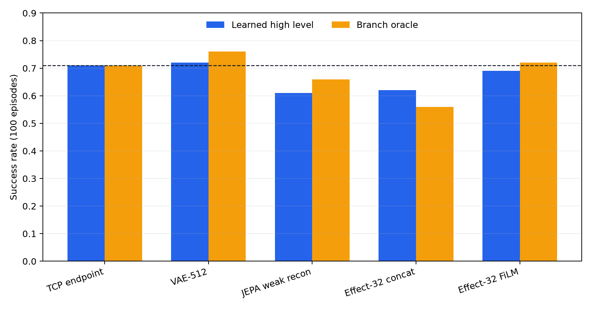
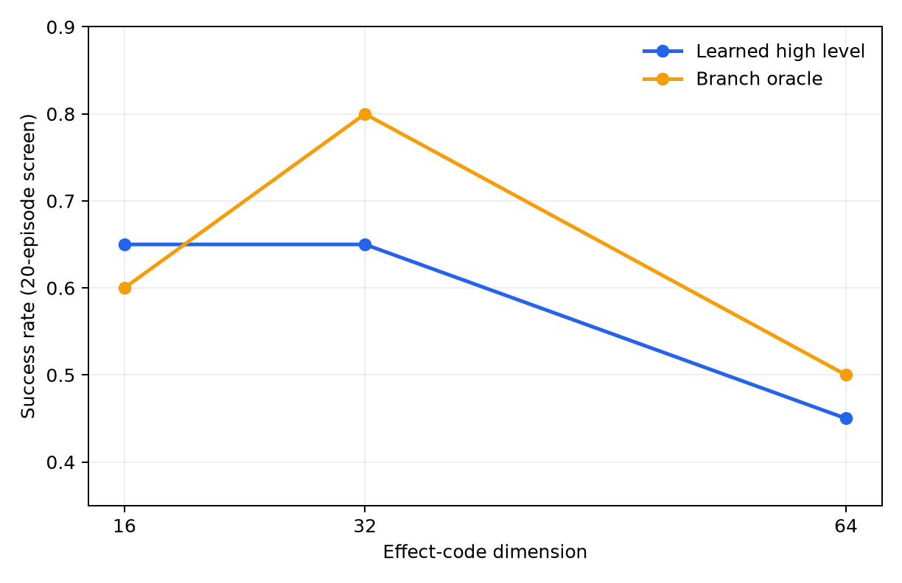

# Learned High/Low Interface Experiments

## Conclusion

The experiments found two viable learned interfaces for Push-T:

| interface | dimensions | learned success | branch-oracle success | interpretation |
| --- | ---: | ---: | ---: | --- |
| VAE future state | 512 | **0.72** | **0.76** | best measured learned state interface |
| Pairwise effect + FiLM | 32 | **0.69** | **0.72** | best compact learned effect interface |
| Explicit TCP endpoint | 3 | **0.71** | **0.71** | physical reference interface |

All values use 100 fixed evaluation episodes and policy seed 0. The requested
500-episode and multi-seed evaluation was skipped because of runtime. The
differences of one to four percentage points should therefore not be treated
as statistically decisive.

The learned-interface hypothesis is positive. A learned future-state or effect
space can match the explicit TCP waypoint on this task. The 512D VAE has the
highest measured success. The 32D pairwise effect is the more interesting
result because it is compact, explicitly action-aware, and does not directly
name the TCP endpoint.



## Common Protocol

### Environment

| setting | value |
| --- | --- |
| task | ManiSkill `PushT-v1` |
| backend | CUDA PhysX |
| controller | `pd_ee_delta_pos` |
| control rate | 20 Hz |
| episode length | 100 controls |
| action | 3D end-effector delta-position |
| reward | normalized dense |

### Observation

Each policy frame is 6,549D:

```text
6,528D frozen DINOv2-small spatial RGB feature
+ 21D non-privileged robot/TCP proprioception
```

The DINO feature contains the CLS token and a flattened `4 x 4` pooled patch
grid. The goal and T-object privileged simulator state are excluded.

### Causal trajectory data

The data file is:

```text
data/prepared/pusht_ppo_dino_spatial_proprio_tcp.h5
```

It contains 2,000 successful trajectories generated by the deterministic
privileged PPO teacher using the same downstream controller and action space.
The split is fixed:

| split | trajectories | transitions |
| --- | ---: | ---: |
| train | 1,800 | 80,472 |
| validation | 200 | 8,969 |

Every candidate uses the same split. Frame, goal, and action standardizers are
fit on training data only.

### Temporal interface

All final learned-interface candidates use:

```text
k = 10 future controls = 0.50 s
U = 10 controls between high-level updates
H = 1 low-level action
```

The high level replans every 10 controls. The low level still observes the
current frame and acts with one-step feedback at every control.

This horizon was inherited from the gated TCP study. The earlier horizon and
update-period sweep found that `k=10,U=10,H=1` gave the strongest stable
temporal abstraction for Push-T. Keeping it fixed makes the learned interfaces
directly comparable with the `0.71` TCP result.

## Candidate 1: VAE-512 Future State

### Representation

The VAE receives one normalized 6,549D frame.

Encoder:

```text
6549 -> 2048 -> 2048 -> 2048
trunk -> mean(512), log_variance(512)
```

The decoder is a depth-3, width-2,048 MLP from 512D to 6,549D. Training samples
the posterior; deployment uses the posterior mean.

Objective:

```text
L = reconstruction + 1e-6 * KL
```

The KL coefficient warms up for 20,000 optimizer steps and uses `0.01` free
bits per dimension. DINO and proprioception reconstruction MSEs are computed
separately and added, preventing the 6,528D visual feature from numerically
overwhelming the 21D proprioception.

Hyperparameters:

| parameter | value |
| --- | ---: |
| batch size | 512 |
| batches/epoch | 400 |
| epochs | 60 |
| learning rate | `3e-4` |
| optimizer | AdamW |
| selected epoch | 29 |
| validation reconstruction MSE | 0.04879 |
| active latent dimensions | 512 / 512 |
| posterior variance mean | 0.03045 |

### High and low policies

The deterministic high level is a depth-4, width-512 MLP:

```text
[current 6549D frame, previous 3D action] -> future 512D VAE mean
```

The low level is another depth-4, width-512 MLP:

```text
[current frame, future latent, previous action, remaining fraction] -> action
```

Both are trained with normalized MSE using batch size 512, 200 batches per
epoch, 60 epochs, AdamW, and learning rate `3e-4`. The hierarchy checkpoint
selected epoch 57 by predicted-goal action MAE.

### Deployment

Every 10 steps, the high level predicts a normalized future VAE latent. That
goal is held while the low level receives a decreasing remaining-time scalar.
No decoder, privileged state, teacher, or simulator branch is used in learned
deployment.

### Result

| goal source | success | final reward | teacher action MAE |
| --- | ---: | ---: | ---: |
| learned high level | **0.72** | 0.786 | 0.1050 |
| exact branch oracle | **0.76** | 0.825 | 0.0788 |

The 4-point oracle gap is small. The VAE result is the highest measured learned
interface and is statistically indistinguishable from the 3D TCP endpoint
under the current 100-episode protocol.

Representative learned rollouts, including one failure, are under:

```text
results/incremental/learned_interface/vae512_w2048_b1e6/seed0/videos/learned/
```

## Candidate 2: 32D Action-Aware Effect Code

### Why this candidate was added

Reconstruction preserves nuisance information, while pure JEPA prediction
discarded useful action information. The pairwise effect encoder instead
learns:

```text
e_t = E(h_t, h_t+10, horizon)
```

It is trained to retain information that predicts both the low-level action
and physical consequences of the future observation.

### Auxiliary physical targets

The 2,000-trajectory DINO file does not retain privileged object states. A
frozen observation probe was therefore trained on the separate causal Phase 6
probe dataset:

```text
data/incremental/phase6_probe_dataset.npz
```

This dataset contains 12,000 teacher-executed visual transitions with physical
labels. The probe maps the same 6,549D observation to:

```text
T position
sin/cos T yaw
T linear/angular velocity
TCP position/velocity
contact probability
```

Probe validation:

| target | metric |
| --- | ---: |
| T position | 5.97 mm RMSE |
| T yaw | 0.0702 rad MAE |
| TCP position | 10.33 mm RMSE |
| contact | 0.962 accuracy, 0.993 AUROC |

The frozen probe generates observation-derived pseudo-labels for effect
training. Privileged state and probe outputs are not available to the deployed
high or low policy.

### Representation architecture

Effect encoder:

```text
input: [normalized h_t, normalized h_t+10, 1.0]  # 13,099D
MLP:   13,099 -> 512 -> 512 -> 512 -> 32
parameters: 7,248,928
```

Training-only action head:

```text
[current frame, effect, previous action, remaining fraction]
-> width-512 depth-4 MLP -> normalized action
```

Training-only auxiliary head:

```text
32D effect -> width-512 depth-3 MLP -> 11 physical values + contact logit
```

Objective:

```text
L =
  action MSE
  + auxiliary continuous MSE
  + contact BCE
  + VICReg variance
  + 0.01 * VICReg covariance
```

Hyperparameters:

| parameter | value |
| --- | ---: |
| batch size | 512 |
| batches/epoch | 200 |
| epoch ceiling | 40 |
| early-stopping patience | 10 |
| learning rate | `3e-4` |
| optimizer | AdamW |
| selected epoch | 39 |
| validation action MSE | 0.02293 |
| active effect dimensions | 32 / 32 |

### High policy

```text
[current 6549D frame, previous 3D action]
-> width-512 depth-4 MLP
-> normalized 32D effect
```

The high model has 4,159,520 parameters.

### FiLM low policy

The initial concatenation policy reached only `0.62/0.56`
learned/oracle success over 100 episodes. It could predict teacher actions
mostly from the current observation and had weak dependence on the effect.

The selected low policy uses the effect to FiLM-modulate every hidden layer:

```text
base input = [current frame, previous action, remaining fraction]
h_l = SiLU(W_l h_(l-1))
gamma_l, beta_l = Linear_l(effect)
h_l = (1 + gamma_l) * h_l + beta_l
```

There are four width-512 hidden layers, four 32-to-1,024 modulators, and a 3D
action output. The low model has 4,280,323 parameters. Modulator weights and
biases start at zero, so training begins as the current-state policy and
learns effect dependence gradually.

Training uses batch size 512, 200 batches per epoch, 60 epochs, AdamW, and
learning rate `3e-4`. The high level is reused unchanged from `effect32`; only
the low policy is retrained. Epoch 57 is selected by predicted-goal action MAE.

FiLM increased the offline prediction-induced action change from `0.00510` to
`0.01031`, and improved 100-episode learned success from `0.62` to `0.69`.

### Deployment

At each high-level update:

```text
effect_hat = high(current observation, previous executed action)
```

The 32D effect is held for 10 low-level controls. The low level receives the
current observation at every step and is FiLM-conditioned by the held effect.
Only RGB, proprioception, and the previous executed action are used.

### Result

| goal source | success | 95% Wilson interval | final reward | teacher action MAE |
| --- | ---: | --- | ---: | ---: |
| learned high level | **0.69** | `[0.594, 0.772]` | 0.767 | 0.1081 |
| exact branch oracle | **0.72** | `[0.625, 0.799]` | 0.796 | 0.0763 |

The learned/oracle ratio is `0.958`. This satisfies the plan's useful-interface
gate and nearly satisfies its strong `>=0.70` learned-success threshold.

Representative videos are under:

```text
results/incremental/learned_interface/effect32_film/seed0/videos/
```

Seeds `2120000` through `2120006` and `2120009` are learned successes.
Seeds `2120007` and `2120008` are learned failures; paired branch-oracle videos
also fail on those two seeds, indicating low-level/task difficulty rather than
only high-level prediction error.

## Capacity and Conditioning Decisions

### Effect dimension

| effect dimension | learned | oracle | decision |
| ---: | ---: | ---: | --- |
| 16 | 0.65 | 0.60 | too compressed for a robust oracle |
| 32 | **0.65** | **0.80** | selected |
| 64 | 0.45 | 0.50 | harder prediction and poorer control |

These are 20-episode screens.



### Goal conditioning

For the same 32D representation and high model:

| low conditioning | learned | oracle | episodes |
| --- | ---: | ---: | ---: |
| concatenation | 0.62 | 0.56 | 100 |
| FiLM | **0.69** | **0.72** | 100 |

The result shows that representation quality alone was not enough. Making the
goal modulate every hidden layer was necessary for reliable effect use.

### Scene-only effect

The scene-only variant removes the 21D proprioception from both endpoints
provided to the effect encoder. The low policy still observes current
proprioception.

| interface | learned | oracle | episodes |
| --- | ---: | ---: | ---: |
| full observation-pair effect | 0.69 | 0.72 | 100 |
| image-only pair effect | 0.55 | 0.60 | 20 |

The image-only effect passes the plan's conceptual gate, but the stronger full
effect indicates that future robot/TCP endpoint information remains useful at
the selected 0.5 s horizon.

## Other Representation Families

| candidate | learned | oracle | main finding |
| --- | ---: | ---: | --- |
| AE-256 + FiLM | 0.55 | 0.67 | low-level oracle improved, high prediction did not |
| VAE-512 | **0.72** | **0.76** | best measured learned state interface |
| DAE-256 | 0.59 | 0.52 | denoising did not improve closed loop |
| JEPA weak reconstruction | 0.61 | 0.66 | some reconstruction was required |
| JEPA balanced reconstruction | 0.65 | 0.58 | offline prediction did not rank closed loop |
| Effect-32 concat | 0.62 | 0.56 | goal dependence too weak |
| Effect-32 FiLM | **0.69** | **0.72** | best compact learned effect |

All rows in this table use 100 episodes.

## Why Later Stages Were Not Run

Sensitivity-weighted high-level prediction is intended for a large
oracle-versus-learned gap. The selected effect has only a 3-point gap.
Candidate sampling is intended for demonstrated multimodality and deterministic
high-level failure. Neither condition is present. Adding these mechanisms
would increase complexity without targeting the measured bottleneck.

The final multi-seed, disturbed, and 200/500-episode protocol was also skipped
under the explicit runtime reduction. The current result is therefore a strong
development result, not a final statistical comparison across training seeds.

## Reproduction

```bash
CONFIG=configs/pusht_incremental.yaml

# Best measured learned state interface
uv run hcl-poc incremental learned-interface-run \
  --config "$CONFIG" --candidate vae512_w2048_b1e6 --episodes 100

# Best compact learned effect interface
uv run hcl-poc incremental learned-interface-run \
  --config "$CONFIG" --candidate effect32_film --episodes 100

# Videos
uv run hcl-poc incremental learned-interface-record \
  --config "$CONFIG" --candidate effect32_film \
  --goal-source learned --episodes 10 --eval-seed-start 2120000

# Figures and machine-readable summary
uv run python scripts/plot_learned_interface_results.py
```

Raw metrics are stored in:

```text
results/incremental/learned_interface/
docs/results/learned_interface/summary.json
```
