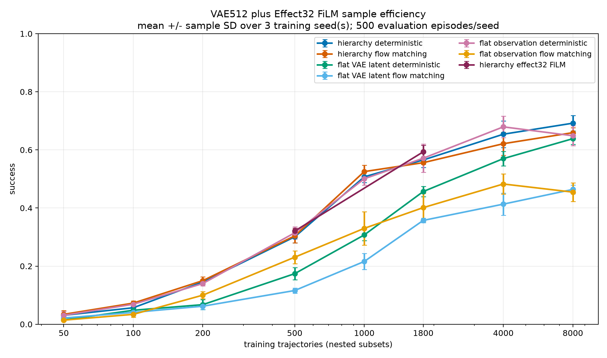

# VAE Future-State Hierarchical Control for Push-T

This repository evaluates whether a learned future-state interface improves
demonstration efficiency for visual control on ManiSkill `PushT-v1`.

The final experiment compares a 512D VAE hierarchy against deterministic and
flow-matching flat policies trained from either the VAE latent or the complete
visual observation. It uses nested demonstration budgets, three independent
policy seeds, and 500 unseen evaluation episodes per deployable point.

The authoritative technical report is
[VAE512_SAMPLE_EFFICIENCY_FINAL_RESULTS.md](VAE512_SAMPLE_EFFICIENCY_FINAL_RESULTS.md).
The experiment plan and chronological execution record are
[vae512_sample_efficiency_experiment_plan.md](vae512_sample_efficiency_experiment_plan.md)
and
[vae512_sample_efficiency_experiment_log.md](vae512_sample_efficiency_experiment_log.md).

## Result

At 8,000 training trajectories:

| Method | Success, mean +/- policy-seed SD |
| --- | ---: |
| Deterministic VAE hierarchy | **`0.692 +/- 0.026`** |
| Flow-matching VAE hierarchy | `0.659 +/- 0.017` |
| Flat VAE latent, deterministic | `0.639 +/- 0.020` |
| Flat VAE latent, flow matching | `0.464 +/- 0.014` |
| Flat full observation, deterministic | `0.649 +/- 0.034` |
| Flat full observation, flow matching | `0.455 +/- 0.032` |
| Reachable branch oracle, 50 episodes/seed | `0.693 +/- 0.070` |



Over the complete 50-8,000 trajectory range, flat full-observation
deterministic control has the best normalized area under the learning curve
(`0.369`), narrowly ahead of the deterministic hierarchy (`0.365`) and flow
hierarchy (`0.363`). At 8,000 trajectories the deterministic hierarchy is the
best deployable method, but its margin is modest with only three policy seeds.

The main conclusion is:

> A future VAE latent restores the performance lost when controlling directly
> from the current VAE latent and becomes the strongest deployable method at
> 8,000 trajectories, but it does not show better efficiency over the complete
> learning curve than deterministic control from the full observation.

No method reaches 70% mean success under the final protocol. The previously
reported `0.72` VAE result was a candidate-selected development result on a
reused 100-episode seed bank. The final report includes the checkpoint and
evaluation-bank cross-audit that explains this discrepancy.

## How We Reached This Experiment

The final comparison was the last stage of a gated investigation rather than
a single architecture choice.

1. **Establish a trustworthy teacher and dataset.** The downloaded Push-T
   trajectories did not replay successfully with the installed simulator and
   controller. We trained a privileged PPO teacher using the exact downstream
   action space, verified its rollouts, and collected a causal corpus from it.
2. **Debug flat imitation before hierarchy.** Direct visual policies were
   evaluated before relying on a learned state. This exposed that the learned
   current latent could discard control-relevant information even when simple
   pose probes looked reasonable.
3. **Study representation families independently.** Deterministic AEs, VAEs,
   denoising AEs, predictive world models, JEPA-style objectives, and learned
   action-aware effect codes were compared using reconstruction, state probes,
   inverse-action probes, future prediction, and closed-loop control.
4. **Correct the oracle definition.** A future goal from a nominal teacher
   trajectory stops being a true oracle after the student deviates. The
   corrected oracle copies the student's exact simulator state and rolls a
   deterministic teacher branch locally, making the supplied goal reachable
   by construction.
5. **Validate the interface with physical state.** Explicit future TCP
   endpoints showed that a future-state interface can work. Multi-offset,
   time-conditioned low-level training was necessary because holding a goal
   changes the remaining horizon after every action.
6. **Select temporal abstraction.** The physical-interface sweep selected
   `k=10`, `U=10`, and `H=1`: a 0.50 s goal held for 10 steps while the low
   level remains closed loop at every primitive action.
7. **Return to learned interfaces.** The best learned state and compact effect
   candidates were promoted through closed-loop development screens, leading
   to the VAE-512 interface used in the final sample-efficiency experiment.

### Best development candidates

These values use the earlier 100-episode candidate-selection protocol and are
useful for understanding model selection, not for replacing the final table.

| Interface | Dimensions | Learned | Oracle | Interpretation |
| --- | ---: | ---: | ---: | --- |
| Explicit TCP endpoint | 3 | 0.71 | 0.71 | strongest interpretable physical reference |
| VAE future state | 512 | **0.72** | **0.76** | best measured learned state interface |
| Effect code + FiLM | 32 | 0.69 | 0.72 | best compact action-aware learned interface |
| Balanced-reconstruction JEPA | 256 | 0.65 | 0.58 | predictive objectives remained competitive |
| Denoising AE | 256 | 0.59 | 0.52 | input denoising did not improve control |
| AE + FiLM | 256 | 0.55 | 0.67 | oracle low level improved more than prediction |

The learned effect interface was deliberately excluded from the final sweep:
the next question was specifically whether the strongest learned **state**
interface improved data efficiency.

### Durable insights

- **Closed-loop evaluation is essential.** Reconstruction loss, pose probes,
  future-latent error, and one-step action MAE did not reliably rank policies
  under compounding rollout error.
- **A probe is diagnostic, not an objective.** Position and orientation probes
  helped detect information loss, but adding pose supervision to the encoder
  would have changed the representation-learning question.
- **Reconstruction remained useful.** Pure predictive/world-model objectives
  tended to lose observation detail; balanced reconstruction produced more
  usable state interfaces.
- **Goal holding needs time conditioning.** A low level trained only at one
  fixed future offset becomes out of distribution after executing the first
  held-goal action.
- **Current-state compression and future-state conditioning are different.**
  Flat control from the 512D VAE latent is clearly worse than flat control from
  the full observation, while a future VAE goal recovers most of that gap.
- **Flow matching is not automatically better.** It did not improve either
  flat policy family and only tied the deterministic high level in the final
  hierarchy.
- **Development results can be optimistic.** Screening many interfaces on one
  seed bank selected an unusually strong VAE checkpoint. The final unseen-bank
  and multi-policy-seed protocol was needed to obtain a defensible estimate.

## Method

The controller runs at 20 Hz with `pd_ee_delta_pos` actions. One observation
contains frozen `facebook/dinov2-small` spatial RGB features and 21D
proprioception:

```text
o_t = [DINO_spatial(rgb_t), proprio_t]  # 6,549 dimensions
z_t = VAE_mean(o_t)                    # 512 dimensions
```

The deterministic hierarchy is:

```text
high: [o_t, a_(t-1)] -> z_(t+10)
low:  [o_t, z_goal, a_(t-1), remaining_time] -> a_t
```

The future horizon and high-level update period are both 10 steps, or 0.50 s.
The low level remains closed loop and executes one primitive action before
observing again. The flow hierarchy replaces only the deterministic high
level; both hierarchies share the same deterministic low-level architecture
within each training point.

The reachable oracle copies the current simulator state, rolls the privileged
teacher forward for 10 steps, and supplies the resulting VAE latent. It is a
diagnostic and is not deployable.

## Data

The downloaded demonstrations did not replay reliably with the installed
simulator/controller combination. A privileged PPO teacher was therefore
trained in the same downstream action space and used to collect successful
causal trajectories.

The privileged PPO expert reached **86.3% success over 256 episodes** in its
original evaluation and **83/100** in the downstream pipeline audit. The
collector retained only successful episodes, so the 2,000-trajectory corpus
is successful-only even though the unfiltered expert was not perfect.

- Training uses nested prefixes of 50, 100, 200, 500, 1,000, 1,800, 4,000,
  and 8,000 trajectories.
- The final 200 trajectories form one fixed validation set.
- The largest training set contains 354,589 transitions.
- Every representation and policy is retrained independently for each budget
  and policy seed; there are no warm starts across budgets.
- The learned effect interface is intentionally excluded from this study.

Large datasets and checkpoints are local under `data/` and `artifacts/`.
Raw evaluations, episode outcomes, generated tables, logs, and videos are
local under `results/incremental/vae512_scaling/`.

## Setup

Dependencies are managed with `uv`. Training and simulator evaluation require
CUDA.

```bash
uv sync --python 3.11
uv run hcl-poc doctor
```

The experiment configuration is
[`configs/pusht_incremental.yaml`](configs/pusht_incremental.yaml).

## Reproduction

Validate the nested data manifests:

```bash
uv run hcl-poc incremental vae-scaling-manifests \
  --config configs/pusht_incremental.yaml
```

Run the resumable training and final evaluation sweeps:

```bash
scripts/run_vae_scaling_sweep.sh train
scripts/run_vae_scaling_sweep.sh eval
```

The driver writes detailed progress to
`results/incremental/vae512_scaling/run_logs/` and prints only point
boundaries. Existing complete point files are reused.

Generate the final tables and plots after all 24 `(budget, seed)` points are
complete:

```bash
uv run hcl-poc incremental vae-scaling-aggregate \
  --config configs/pusht_incremental.yaml \
  --episodes 500 \
  --oracle-episodes 50 \
  --seeds 0 1 2 \
  --output-name aggregate
```

The tracked final plots are in `docs/results/vae512_scaling/`. Representative
full-data learned and oracle successes/failures are in:

```text
results/incremental/vae512_scaling/n8000/learned_interface/
  vae512_w2048_b1e6/seed0/videos/{learned,oracle}/
```

## Archived Experiments

Earlier gated experiments remain available as research history, but they are
not the final result of this repository:

- [LEARNED_INTERFACE_FINAL_RESULTS.md](LEARNED_INTERFACE_FINAL_RESULTS.md):
  candidate-selection development results for VAE and effect interfaces.
- [pre_rl_summary.md](pre_rl_summary.md): explicit TCP endpoint interface.
- [rl_rerun_final_results.md](rl_rerun_final_results.md): exact-reset
  low-level RL rerun with R1/R2/R3 comparisons. The best R3 setting averaged
  no fresh-bank deployment gain across two 500-episode checks (`-0.002` success
  delta); bounded oracle diagnostics suggest both learned-goal error and weak
  low-level goal sensitivity remain bottlenecks. The strict completion audit is
  [rl_rerun_completion_audit.md](rl_rerun_completion_audit.md).
- [FINAL_RESULTS_AND_CANDIDATES.md](FINAL_RESULTS_AND_CANDIDATES.md): earlier
  AE hierarchy and flat-policy studies.
- [INCREMENTAL_EXPERIMENT_LOG.md](INCREMENTAL_EXPERIMENT_LOG.md): complete
  chronological record of the earlier gated pipeline.

These reports explain how the final experiment was reached; their smaller or
reused evaluation protocols should not be compared directly with the final
three-seed, 500-episode results above.
