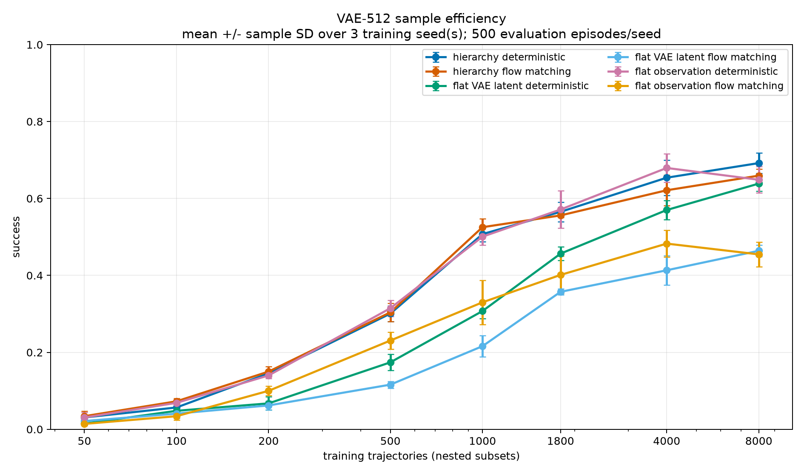

# VAE Future-State Hierarchical Control for Push-T

This repository evaluates whether a learned future-state interface improves
demonstration efficiency for visual control on ManiSkill `PushT-v1`.

The final experiment compares a 512D VAE hierarchy against deterministic and
flow-matching flat policies trained from either the VAE latent or the complete
visual observation. It uses nested demonstration budgets, three independent
policy seeds, and 500 unseen evaluation episodes per deployable point.

The authoritative technical report is
[VAE512_SAMPLE_EFFICIENCY_FINAL_RESULTS.md](VAE512_SAMPLE_EFFICIENCY_FINAL_RESULTS.md).
The experiment plan and chronological execution record are
[vae512_sample_efficiency_experiment_plan.md](vae512_sample_efficiency_experiment_plan.md)
and
[vae512_sample_efficiency_experiment_log.md](vae512_sample_efficiency_experiment_log.md).

## Result

At 1,800 training trajectories:

| Method | Success, mean +/- policy-seed SD |
| --- | ---: |
| Deterministic VAE hierarchy | `0.565 +/- 0.025` |
| Flow-matching VAE hierarchy | `0.556 +/- 0.005` |
| Flat VAE latent, deterministic | `0.457 +/- 0.017` |
| Flat VAE latent, flow matching | `0.357 +/- 0.008` |
| Flat full observation, deterministic | **`0.571 +/- 0.048`** |
| Flat full observation, flow matching | `0.401 +/- 0.049` |
| Reachable branch oracle, 50 episodes/seed | `0.520 +/- 0.035` |



The flow hierarchy has the best normalized area under the learning curve
(`0.259`), narrowly ahead of flat full-observation deterministic control
(`0.255`) and the deterministic hierarchy (`0.251`). With only three policy
seeds, this difference is too small to support a sample-efficiency claim.

The main conclusion is:

> A future VAE latent restores the performance lost when controlling directly
> from the current VAE latent, but it does not robustly outperform a
> deterministic policy using the complete observation.

No method reaches 70% mean success under the final protocol. The previously
reported `0.72` VAE result was a candidate-selected development result on a
reused 100-episode seed bank. The final report includes the checkpoint and
evaluation-bank cross-audit that explains this discrepancy.

## Method

The controller runs at 20 Hz with `pd_ee_delta_pos` actions. One observation
contains frozen `facebook/dinov2-small` spatial RGB features and 21D
proprioception:

```text
o_t = [DINO_spatial(rgb_t), proprio_t]  # 6,549 dimensions
z_t = VAE_mean(o_t)                    # 512 dimensions
```

The deterministic hierarchy is:

```text
high: [o_t, a_(t-1)] -> z_(t+10)
low:  [o_t, z_goal, a_(t-1), remaining_time] -> a_t
```

The future horizon and high-level update period are both 10 steps, or 0.50 s.
The low level remains closed loop and executes one primitive action before
observing again. The flow hierarchy replaces only the deterministic high
level; both hierarchies share the same deterministic low-level architecture
within each training point.

The reachable oracle copies the current simulator state, rolls the privileged
teacher forward for 10 steps, and supplies the resulting VAE latent. It is a
diagnostic and is not deployable.

## Data

The downloaded demonstrations did not replay reliably with the installed
simulator/controller combination. A privileged PPO teacher was therefore
trained in the same downstream action space and used to collect 2,000 causal
trajectories.

- Training uses nested prefixes of 50, 100, 200, 500, 1,000, and 1,800
  trajectories.
- The final 200 trajectories form one fixed validation set.
- The largest training set contains 80,472 transitions.
- Every representation and policy is retrained independently for each budget
  and policy seed; there are no warm starts across budgets.
- The learned effect interface is intentionally excluded from this study.

Large datasets and checkpoints are local under `data/` and `artifacts/`.
Raw evaluations, episode outcomes, generated tables, logs, and videos are
local under `results/incremental/vae512_scaling/`.

## Setup

Dependencies are managed with `uv`. Training and simulator evaluation require
CUDA.

```bash
uv sync --python 3.11
uv run hcl-poc doctor
```

The experiment configuration is
[`configs/pusht_incremental.yaml`](configs/pusht_incremental.yaml).

## Reproduction

Validate the nested data manifests:

```bash
uv run hcl-poc incremental vae-scaling-manifests \
  --config configs/pusht_incremental.yaml
```

Run the resumable training and final evaluation sweeps:

```bash
scripts/run_vae_scaling_sweep.sh train
scripts/run_vae_scaling_sweep.sh eval
```

The driver writes detailed progress to
`results/incremental/vae512_scaling/run_logs/` and prints only point
boundaries. Existing complete point files are reused.

Generate the final tables and plots after all 18 `(budget, seed)` points are
complete:

```bash
uv run hcl-poc incremental vae-scaling-aggregate \
  --config configs/pusht_incremental.yaml \
  --episodes 500 \
  --oracle-episodes 50 \
  --seeds 0 1 2 \
  --output-name aggregate
```

The tracked final plots are in `docs/results/vae512_scaling/`. Representative
full-data learned and oracle successes/failures are in:

```text
results/incremental/vae512_scaling/n1800/learned_interface/
  vae512_w2048_b1e6/seed2/videos/
```

## Archived Experiments

Earlier gated experiments remain available as research history, but they are
not the final result of this repository:

- [LEARNED_INTERFACE_FINAL_RESULTS.md](LEARNED_INTERFACE_FINAL_RESULTS.md):
  candidate-selection development results for VAE and effect interfaces.
- [pre_rl_summary.md](pre_rl_summary.md): explicit TCP endpoint interface.
- [FINAL_RESULTS_AND_CANDIDATES.md](FINAL_RESULTS_AND_CANDIDATES.md): earlier
  AE hierarchy and flat-policy studies.
- [INCREMENTAL_EXPERIMENT_LOG.md](INCREMENTAL_EXPERIMENT_LOG.md): complete
  chronological record of the earlier gated pipeline.

These reports explain how the final experiment was reached; their smaller or
reused evaluation protocols should not be compared directly with the final
three-seed, 500-episode results above.
