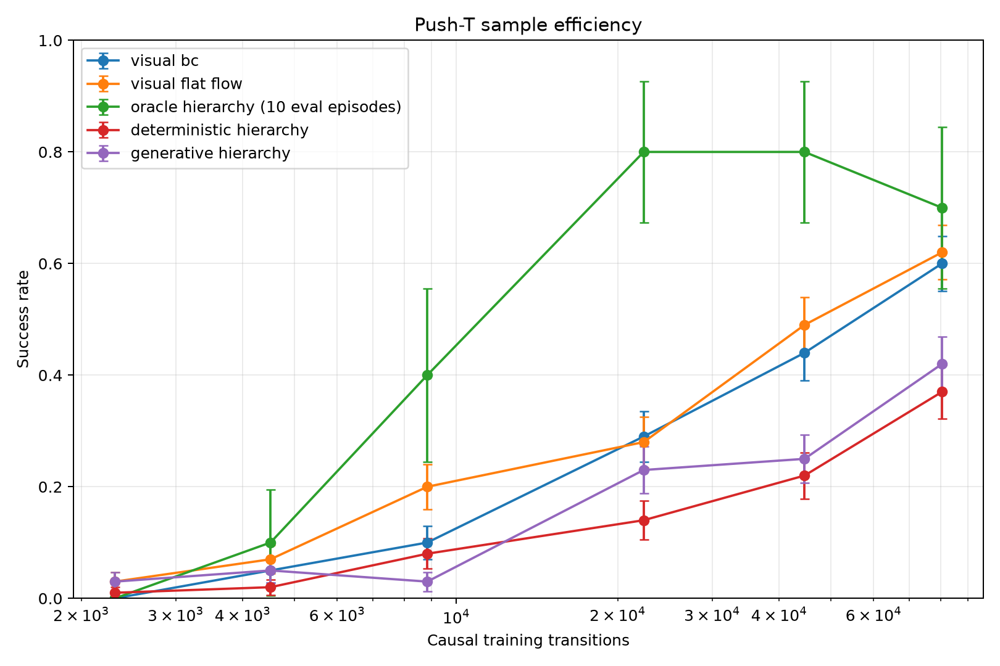

# Push-T Hierarchical Control POC

This repository studies hierarchical visual control on ManiSkill `PushT-v1`.
The original future-AE-latent hierarchy failed when its high level had to
predict deployable goals. A gated follow-up identified a compact future TCP
waypoint as a substantially better interface.

The final pre-RL result is:

- learned raw-visual TCP hierarchy: `0.71` success over 100 episodes;
- exact reachable branch-oracle TCP hierarchy: `0.71`;
- selected interface: 10-step (0.50 s) TCP endpoint, held for 10 primitive
  controls, with one-step low-level feedback.

The authoritative result, architecture, data, gate decisions, and RL
recommendation are in [pre_rl_summary.md](pre_rl_summary.md). The experiment
plan and chronological record are
[pusht_pre_rl_next_experiments_plan.md](pusht_pre_rl_next_experiments_plan.md)
and [next_experiments_log.md](next_experiments_log.md).

The earlier future-latent candidates remain documented in
[FINAL_RESULTS_AND_CANDIDATES.md](FINAL_RESULTS_AND_CANDIDATES.md) as the
negative predecessor.

## Method

The environment uses `pd_ee_delta_pos` control at 20 Hz. Observations contain
frozen `facebook/dinov2-small` spatial RGB features and non-privileged robot
proprioception. The selected current representation is the uncompressed
6,549D DINO-plus-proprioception vector.

```text
h_t = [DINO_spatial(rgb_t), proprio_t]
```

Every 10 actions, the high level predicts the TCP position 10 steps ahead.
The low level receives the current representation, endpoint, time-to-go
velocity, previous executed action, and remaining time:

```text
a_t = pi_low(h_t, p_tcp_goal, v_tcp_goal, a_{t-1}, time_to_go)
```

The learned endpoint is compared with an exact local branch oracle generated
by copying the current student state and rolling the privileged teacher for 10
steps. Both use the same frozen low level.

AE-256, VAE-256, raw DINO, future robot/object decompositions, multiple
horizons, goal update periods, and causal recovery datasets were tested before
selecting this configuration.

## Setup

Dependencies are managed with `uv`; training and simulator evaluation require
CUDA.

```bash
uv sync --python 3.11
uv run hcl-poc doctor
```

The final incremental configuration is
[`configs/pusht_incremental.yaml`](configs/pusht_incremental.yaml).

## Data

The original downloaded demonstrations did not replay successfully under the
installed simulator/controller combination. A privileged PPO teacher was
therefore trained using the same downstream action space. The prepared HDF5
dataset contains 2,000 successful causal trajectories with frozen DINO
features, proprioception, simulator state for diagnostics, and teacher
actions. The final 200 trajectories are a fixed validation set; training uses
nested prefixes of the first 1,800.

To rebuild the incremental teacher dataset and its basic checks:

```bash
CONFIG=configs/pusht_incremental.yaml

uv run hcl-poc incremental phase0 --config "$CONFIG"
uv run hcl-poc incremental phase1-collect --config "$CONFIG"
uv run hcl-poc incremental phase1-train --config "$CONFIG"
uv run hcl-poc incremental phase1-eval --config "$CONFIG"
```

Subsequent phase commands are listed by `uv run hcl-poc incremental --help`.
They are intentionally gated; follow the plan and log when reproducing the
representation and oracle diagnostics from scratch.

## Selected Hierarchy

```bash
CONFIG=configs/pusht_incremental.yaml

uv run hcl-poc incremental pre-rl-f-train-visual-tcp \
  --config "$CONFIG" --representation raw

uv run hcl-poc incremental pre-rl-f-eval-visual-tcp \
  --config "$CONFIG" --representation raw --goal-source learned --episodes 100

uv run hcl-poc incremental pre-rl-f-eval-visual-tcp \
  --config "$CONFIG" --representation raw --goal-source oracle --episodes 100

uv run hcl-poc incremental pre-rl-g-tcp-diagnostics \
  --config "$CONFIG"
```

## Legacy Future-Latent Sweep

Each Phase 12 budget retrains visual BC, visual action flow, AE-256, the oracle
low level, deterministic high level, and generative high level in an isolated
artifact directory. No checkpoint is transferred between data budgets.

```bash
CONFIG=configs/pusht_incremental.yaml

for N in 50 100 200 500 1000 1800; do
  uv run hcl-poc incremental phase12-run \
    --config "$CONFIG" \
    --n-trajectories "$N" \
    --episodes 100 \
    --eval-seed-start 1200000
done

uv run hcl-poc incremental phase12-plot --config "$CONFIG"
```

All deployable methods use one policy seed and the same 100 evaluation seeds.
Exact branch replay is much slower and uses 10 of those seeds per budget. The
plot reports binomial standard errors. This reduced protocol does not measure
training-seed robustness.

## Current Results

| Method | Success | Final reward |
| --- | ---: | ---: |
| Learned raw TCP hierarchy | **0.71** | 0.781 |
| Exact branch-oracle TCP hierarchy | **0.71** | 0.794 |
| Learned AE-256 TCP hierarchy | 0.53 | 0.639 |


The learned/oracle ratio is 1.00. Endpoint error rises from `0.0175 m` on
held-out teacher states to `0.0372 m` on hierarchy states and `0.0611 m` on
recovery states, but the exact endpoint does not improve closed-loop success.
The first RL experiment should therefore freeze the high level and train a
small low-level residual adapter for recovery.

Representative learned and paired oracle videos are generated under
`results/incremental/pre_rl/phase_f/raw_tcp/seed0/videos/`.

## Legacy Results

| Trajectories | Transitions | Visual BC | Flat flow | Oracle hierarchy | Deterministic hierarchy | Generative hierarchy |
| ---: | ---: | ---: | ---: | ---: | ---: | ---: |
| 50 | 2,311 | 0.00 | 0.03 | 0.00 | 0.01 | 0.03 |
| 100 | 4,507 | 0.05 | 0.07 | 0.10 | 0.02 | 0.05 |
| 200 | 8,834 | 0.10 | 0.20 | 0.40 | 0.08 | 0.03 |
| 500 | 22,367 | 0.29 | 0.28 | 0.80 | 0.14 | 0.23 |
| 1000 | 44,605 | 0.44 | 0.49 | 0.80 | 0.22 | 0.25 |
| 1800 | 80,472 | 0.60 | 0.62 | 0.70 | 0.37 | 0.42 |



The plotted values and protocol metadata are available as
[`docs/results/incremental_sample_efficiency.json`](docs/results/incremental_sample_efficiency.json).

The exact oracle first reaches 50% measured success at 22,367 transitions;
both direct visual policies first reach it at 80,472. This supports the
future-state interface as a useful temporal abstraction, but the oracle uses a
privileged teacher online and is not deployable. Its 10-episode points also
have substantially wider uncertainty.

The learned hierarchy does not inherit the oracle's data-efficiency advantage.
At 1,800 trajectories, deterministic and generative hierarchies reach 0.37 and
0.42 success, below visual BC at 0.60 and flat flow at 0.62. Detailed Phase
8-10 diagnostics show that future-latent prediction remains the dominant
bottleneck: the predicted goals have moderate offline error but induce
compounding closed-loop action error. Robust low-level training on measured
high-level errors did not recover performance.

The legacy deployable future-AE-latent hypothesis is negative. The factorized
TCP waypoint experiments resolve that earlier bottleneck without claiming
that arbitrary learned latent goals are suitable control interfaces.

Large datasets, checkpoints, detailed raw result JSON, and videos remain local
and are ignored by Git.
