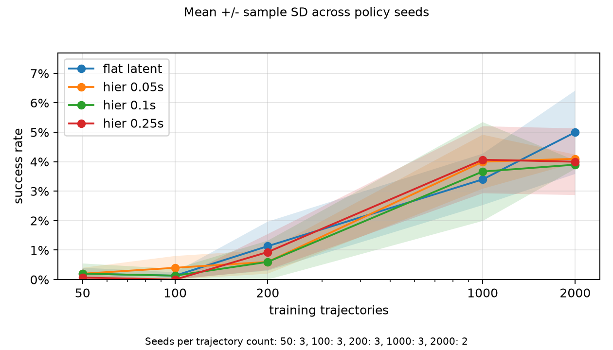
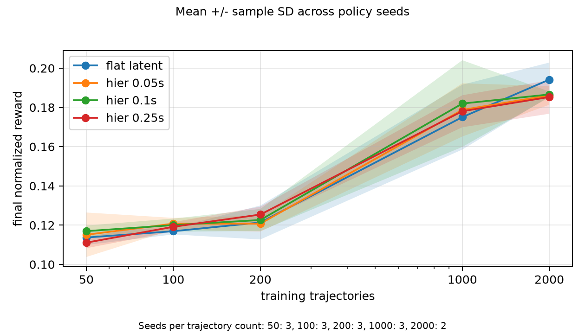
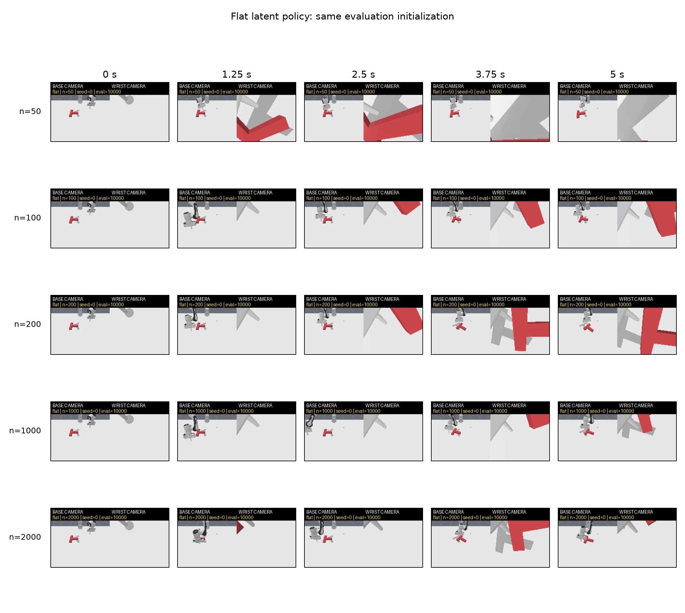
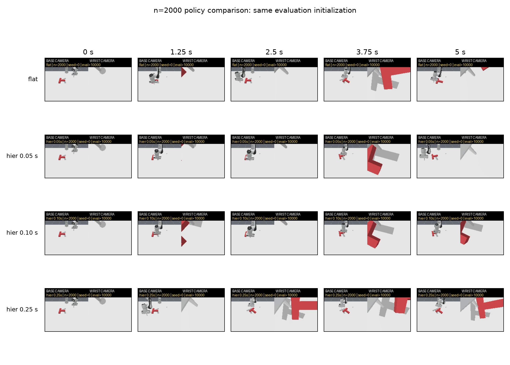

# Push-T Future-Latent Hierarchy POC

This repository tests a two-level imitation-learning architecture on
ManiSkill `PushT-v1`. A high-level flow model predicts a future latent state,
and a low-level flow policy uses that latent as a subgoal. The main comparison
is against a flat latent-conditioned flow policy.

The final experiment uses:

- `pd_ee_delta_pos` control at 20 Hz;
- RGB encoded by frozen `facebook/dinov2-small` spatial features;
- non-privileged robot proprioception;
- a 512D observation latent trained by an action-conditioned world model;
- hierarchy horizons of 0.05, 0.10, and 0.25 seconds;
- nested training sets of 50, 100, 200, 1000, and 2000 successful rollouts;
- 500 evaluation episodes per policy seed.

The complete implementation history, debugging record, ablations, probes, and
results are in [EXPERIMENT_REPORT.md](EXPERIMENT_REPORT.md).

## Setup

Python dependencies are managed with `uv`:

```bash
uv sync --python 3.11
uv run hcl-poc doctor
```

Full teacher training and dataset collection require CUDA. The imitation
policies can run on CPU for smoke tests, but the complete experiment is
intended for a GPU.

The final configuration is:

```text
configs/pusht_spatial_wm_recon512_lownoise.yaml
```

## Data

The downloaded ManiSkill demonstrations did not replay successfully with
their recorded actions in the installed simulator. The project therefore
trains a privileged-state PPO teacher using the same downstream action space
and records only its successful causal rollouts.

```bash
CONFIG=configs/pusht_spatial_wm_recon512_lownoise.yaml

uv run hcl-poc rl train --config "$CONFIG"
uv run hcl-poc rl eval --config "$CONFIG"
uv run hcl-poc data prepare --config "$CONFIG"
```

The teacher reached 86.3% deterministic success over 256 episodes. The
prepared HDF5 dataset contains 2000 successful rollouts and stores frozen DINO
features, `qpos`, `qvel`, `tcp_pose`, and clipped teacher actions.

## Method

The frozen DINO representation and robot proprioception are mapped to a latent
state:

```text
z_t = E_o(DINO(rgb_t), proprio_t)
```

`E_o` is trained through a separate action-conditioned, multi-horizon world
model:

```text
z_hat_{t+k} = F_dyn(z_t, a_t, ..., a_{t+k-1}, k)
```

The final world-model loss also reconstructs its DINO/proprio input. It does
not use object-pose labels. After this stage, the dynamics model is discarded
and the observation encoder is frozen.

The hierarchical high-level model is a different model and never receives
actions:

```text
g_t ~ p_high(z_{t+k} | z_t)
```

The low-level policy conditions on the current latent and sampled future
latent:

```text
a_{t:t+H-1} ~ pi_low(a_{t:t+H-1} | z_t, g_t)
```

The low-level policy is trained with latent subgoal noise. This closes the
large offline error gap between oracle future latents and subgoals sampled by
the high-level policy.

## Train And Evaluate

Train one complete policy set:

```bash
CONFIG=configs/pusht_spatial_wm_recon512_lownoise.yaml
N=1000
SEED=0

uv run hcl-poc train encoder --config "$CONFIG" --n-traj "$N" --seed "$SEED"
uv run hcl-poc train flat --config "$CONFIG" --n-traj "$N" --seed "$SEED"

for H in 0.05 0.10 0.25; do
  uv run hcl-poc train high \
    --config "$CONFIG" --n-traj "$N" --seed "$SEED" --horizon-s "$H"
  uv run hcl-poc train low \
    --config "$CONFIG" --n-traj "$N" --seed "$SEED" --horizon-s "$H"
done
```

Evaluate each policy over 500 episodes:

```bash
uv run hcl-poc eval flat \
  --config "$CONFIG" --n-traj "$N" --seed "$SEED" --episodes 500

for H in 0.05 0.10 0.25; do
  uv run hcl-poc eval hier \
    --config "$CONFIG" --n-traj "$N" --seed "$SEED" \
    --horizon-s "$H" --episodes 500
done

uv run hcl-poc report --config "$CONFIG"
```

Record videos:

```bash
uv run hcl-poc video flat \
  --config "$CONFIG" --n-traj 2000 --seed 0 --episodes 4

uv run hcl-poc video hier \
  --config "$CONFIG" --n-traj 2000 --seed 0 \
  --horizon-s 0.05 --episodes 4
```

## Final Results

The table reports mean success rate +/- sample standard deviation across
policy seeds. Each policy seed was evaluated on the same 500 environment
initializations. Results through 1000 trajectories use three policy seeds;
the 2000-trajectory result uses two.

| Training trajectories | Flat latent | Hier 0.05 s | Hier 0.10 s | Hier 0.25 s |
| ---: | ---: | ---: | ---: | ---: |
| 50 | 0.20% +/- 0.20% | 0.20% +/- 0.20% | 0.20% +/- 0.35% | 0.07% +/- 0.12% |
| 100 | 0.13% +/- 0.12% | 0.40% +/- 0.40% | 0.13% +/- 0.23% | 0.00% +/- 0.00% |
| 200 | 1.13% +/- 0.83% | 0.60% +/- 0.40% | 0.60% +/- 0.72% | 0.93% +/- 0.61% |
| 1000 | 3.40% +/- 0.87% | 4.00% +/- 0.92% | 3.67% +/- 1.68% | 4.07% +/- 1.14% |
| 2000 | 5.00% +/- 1.41% | 4.10% +/- 0.14% | 3.90% +/- 0.14% | 4.00% +/- 1.13% |

At 2000 trajectories, the flat policy has final normalized reward
`0.194 +/- 0.009` and maximum normalized reward `0.234 +/- 0.008`. The three
hierarchies have final reward around `0.185-0.187` and maximum reward around
`0.224-0.226`.





Additional KPI plots:

- [maximum reward](docs/results/max_reward_vs_trajectories.png)
- [inference latency](docs/results/inference_latency_s_vs_trajectories.png)

The result is negative for the main hypothesis: performance improves with
more demonstrations, but the hierarchy does not show a data-efficiency
advantage over the flat latent policy. At 1000 trajectories the methods are
within seed variance; at 2000 trajectories the flat policy has the highest
mean success and dense reward.

## Representation Diagnostics

A held-out pose probe was used only to assess frozen representations:

| Representation | x MAE | y MAE | yaw MAE |
| --- | ---: | ---: | ---: |
| Spatial DINO input | 3.8 mm | 4.1 mm | 3.8 deg |
| Original 64D world-model latent | 3.62 cm | 4.57 cm | 30.3 deg |
| 512D latent without reconstruction | 3.64 cm | 4.77 cm | 28.7 deg |
| Final 512D reconstruction latent | 8.2 mm | 9.0 mm | 9.2 deg |

The reconstruction objective, rather than latent size alone, is what retained
the task-relevant pose information. No pose-supervised loss was added to the
encoder.

## Videos

Twenty dual-camera videos compare seed 0 on the same evaluation
initialization across all five data sizes and all four policies:

```text
results/ppo_spatial_wm_recon512_lownoise/videos/dual_camera_seed0/
```

The selected initialization is unsuccessful for every policy, so these
videos are qualitative failure/progress comparisons rather than cherry-picked
successes.





The metrics, plots, contact sheets, and videos are also packaged in:

```text
results/ppo_spatial_wm_recon512_lownoise.zip
```

Large datasets, checkpoints, and raw run logs remain local and are ignored by
Git.
