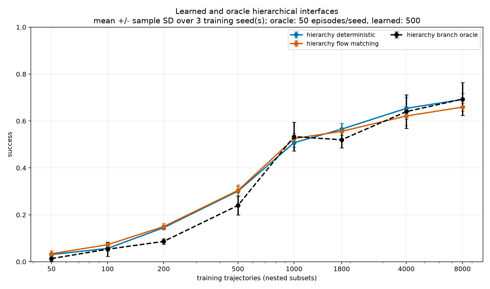

# VAE-512 Sample-Efficiency Final Results

## Scope

This experiment measures whether a learned VAE future-state interface reduces
the number of demonstrations needed for Push-T control. It excludes the
learned effect interface. Every model is retrained from scratch for each data
budget and policy seed.

The complete plan and chronological audit are
[`vae512_sample_efficiency_experiment_plan.md`](vae512_sample_efficiency_experiment_plan.md)
and
[`vae512_sample_efficiency_experiment_log.md`](vae512_sample_efficiency_experiment_log.md).
Machine-readable results, individual seed values, episode outcomes, timing,
and diagnostics are under `results/incremental/vae512_scaling/aggregate/`.

## Protocol

### Data

The source is a successful-only corpus collected from the privileged PPO
teacher using the downstream `pd_ee_delta_pos` action space. The original
2,000-trajectory file supplies the first 1,800 training trajectories and the
fixed validation set. A resumable vectorized expert collection adds 6,200
successful trajectories in
`data/prepared/pusht_ppo_dino_spatial_proprio_tcp_8200.h5`.

- Train sets are nested prefixes of 50, 100, 200, 500, 1,000, 1,800, 4,000,
  and 8,000 trajectories.
- The final 200 trajectories are a fixed validation set and never overlap
  training.
- Train transition counts are 2,311, 4,507, 8,834, 22,367, 44,605, 80,472,
  177,972, and 354,589.
- Each budget is trained independently for policy seeds 0, 1, and 2.
- No checkpoint is warm-started from another budget.

### Evaluation

All deployable methods use the same 500 unseen environment seeds beginning at
2,200,000. The branch oracle uses the first 50 seeds from that bank because it
requires online teacher branches. Success is mean episode success. Plot points
are means over three independently trained policy seeds; error bars are sample
standard deviations over those three seeds.

The old 2,100,000 bank is not used for the final comparison because it was
reused while selecting learned-interface candidates.

## Observation and representation

One observation is a 6,549D vector:

```text
[4x4 spatial facebook/dinov2-small RGB tokens, 21D proprioception]
```

DINO is frozen. The VAE encoder is:

```text
6549 -> 2048 -> 2048 -> 2048 -> mean(512), log_variance(512)
```

The decoder is a depth-3, width-2,048 MLP from 512D to 6,549D. Training samples
the posterior; policies always use the posterior mean. The loss is separated
DINO and proprioception reconstruction plus `1e-6 * KL`, with a 20,000-step KL
warmup and 0.01 free bits per dimension. The complete VAE has 46,767,509
parameters.

VAE training uses AdamW, learning rate `3e-4`, batch size 512, 400 batches per
epoch, and 60 epochs. The checkpoint minimizes validation reconstruction loss.

## Compared controllers

### Deterministic hierarchy

The high level predicts the normalized future 512D posterior mean:

```text
[current 6549D observation, previous 3D action] -> future latent
```

The shared low level is a depth-4, width-512 MLP:

```text
[current observation, held future latent, previous action, remaining fraction]
-> 3D action
```

The future horizon and update period are both 10 simulator steps. At 20 Hz,
the interface horizon is 0.50 s. The low level executes one action at a time,
so `H=1`, while the high level replans every `U=10` steps. The combined high
and low models contain 8,813,059 parameters.

### Flow hierarchy

This method shares the exact deterministic low level above. Its high level is
a conditional flow model with a 6,552D condition and 512D sample, width 512,
4,700,672 parameters, and 24 integration steps. A reproducible Gaussian noise
sample is keyed by training seed, environment seed, decision index, and goal
dimension.

### Branch oracle hierarchy

The oracle shares the deterministic hierarchy's low level. At each replan, a
privileged teacher branch starts from the exact current student state, rolls
forward 10 steps, and supplies the resulting VAE posterior mean. It is not
deployable and is evaluated on only 50 episodes per policy seed.

### Flat latent controllers

The deterministic and flow policies receive the 512D current VAE mean and the
previous 3D action. Condition dimension is 515. The deterministic MLP has
1,053,699 parameters; the flow model has 1,088,003 parameters and 24 flow
steps.

### Flat full-observation controllers

These receive the uncompressed 6,549D observation and previous action. The
condition dimension is 6,552. The deterministic MLP has 4,144,643 parameters;
the flow model has 4,178,947 parameters and 24 flow steps.

All policy models use AdamW, learning rate `3e-4`, batch size 512, 200 batches
per epoch, and 60 epochs. Flat checkpoints minimize validation action MAE.
Hierarchy checkpoints minimize predicted-goal low-level action MAE.

## Final success

| trajectories | det hierarchy | flow hierarchy | oracle | flat latent det | flat latent flow | flat obs det | flat obs flow |
| ---: | ---: | ---: | ---: | ---: | ---: | ---: | ---: |
| 50 | 0.031 +/- 0.006 | 0.034 +/- 0.013 | 0.013 +/- 0.012 | 0.015 +/- 0.004 | 0.021 +/- 0.003 | 0.031 +/- 0.013 | 0.014 +/- 0.004 |
| 100 | 0.057 +/- 0.010 | 0.073 +/- 0.008 | 0.053 +/- 0.031 | 0.048 +/- 0.009 | 0.041 +/- 0.012 | 0.069 +/- 0.006 | 0.034 +/- 0.010 |
| 200 | 0.145 +/- 0.007 | 0.150 +/- 0.013 | 0.087 +/- 0.012 | 0.067 +/- 0.017 | 0.062 +/- 0.011 | 0.140 +/- 0.008 | 0.100 +/- 0.012 |
| 500 | 0.301 +/- 0.020 | 0.304 +/- 0.024 | 0.240 +/- 0.040 | 0.174 +/- 0.021 | 0.116 +/- 0.009 | 0.315 +/- 0.021 | 0.231 +/- 0.022 |
| 1,000 | 0.507 +/- 0.020 | **0.525 +/- 0.022** | 0.533 +/- 0.061 | 0.307 +/- 0.020 | 0.216 +/- 0.028 | 0.501 +/- 0.022 | 0.330 +/- 0.058 |
| 1,800 | 0.565 +/- 0.025 | 0.556 +/- 0.005 | 0.520 +/- 0.035 | 0.457 +/- 0.017 | 0.357 +/- 0.008 | **0.571 +/- 0.048** | 0.401 +/- 0.049 |
| 4,000 | 0.654 +/- 0.046 | 0.621 +/- 0.040 | 0.640 +/- 0.072 | 0.570 +/- 0.025 | 0.413 +/- 0.038 | **0.679 +/- 0.037** | 0.483 +/- 0.035 |
| 8,000 | **0.692 +/- 0.026** | 0.659 +/- 0.017 | 0.693 +/- 0.070 | 0.639 +/- 0.020 | 0.464 +/- 0.014 | 0.649 +/- 0.034 | 0.455 +/- 0.032 |


No deployable method reaches 70% mean success. Interpolated `N50` and
normalized area under the success curve over log trajectories are:

| method | N50 trajectories | N50 transitions | normalized log-AULC |
| --- | ---: | ---: | ---: |
| deterministic hierarchy | 976 | 43,816 | 0.365 |
| flow hierarchy | **924** | **42,060** | 0.363 |
| flat observation deterministic | 998 | 44,525 | **0.369** |
| oracle hierarchy | 924 | 42,078 | 0.340 |
| flat latent deterministic | 2,443 | 117,751 | 0.274 |
| flat observation flow | not reached | not reached | 0.256 |
| flat latent flow | not reached | not reached | 0.204 |

Flat observation deterministic has the largest AULC, ahead of deterministic
hierarchy by 0.004 and flow hierarchy by 0.006. This does not support a
sample-efficiency advantage for hierarchy over the complete range. However,
the deterministic hierarchy is the strongest deployable method at 8,000
trajectories and improves monotonically from 1,800 through 8,000.

Flow matching does not help the flat policies. It is also not consistently
better than the deterministic hierarchy: flow leads at 1,000 trajectories,
while deterministic leads from 1,800 through 8,000.

## Oracle interpretation



The oracle does not establish a positive upper gap in this experiment. At
8,000 trajectories it scores `0.693 +/- 0.070`, effectively equal to the
deterministic learned hierarchy. The oracle has only 50 episodes per seed and
the low level was trained on nominal future goals rather than online branch
goals. These results do not support the claim that high-level latent
prediction is the dominant bottleneck.

## Why the previous VAE result was 0.72

The previously promoted VAE hierarchy scored 0.72 on 100 development episodes
starting at seed 2,100,000. The new full-data seed-0 hierarchy initially scored
0.46 on 100 unseen episodes, so the discrepancy was audited before final
evaluation.

- Old and new VAE tensors are bit-identical.
- All 1,800 train and 200 validation latent trajectories are exactly equal.
- The old checkpoint scores 0.72 on the development bank but 0.56 on the new
  bank.
- The new seed-0 checkpoint scores 0.64 on the development bank and 0.46 on
  the new bank.
- The three new learned policies score 0.46, 0.43, and 0.51 on the first 100
  unseen seeds.
- Their 50-episode oracle lows score 0.50, 0.56, and 0.50; the old selected
  low scores 0.68 on the same unseen bank.

The old 0.72 was a development result selected after screening many candidates
on a reused seed bank and from an unusually strong low-level training
realization. The final 500-episode, three-seed result is the appropriate
estimate. No encoder, data, horizon, or deployment wiring error was found.

## Videos

Representative learned and branch-oracle rollouts are under:

```text
results/incremental/vae512_scaling/n8000/learned_interface/
  vae512_w2048_b1e6/seed0/videos/{learned,oracle}/
```

The directories contain successes and failures. Video filenames record the
actual single-environment outcome. Single-environment rendering can differ
from the vectorized evaluation outcome for the same nominal seed, so video
labels are not copied from the vectorized result arrays.

## Reproduction

```bash
uv sync --python 3.11

# Manifests and nested-split validation
uv run hcl-poc incremental vae-scaling-manifests \
  --config configs/pusht_incremental.yaml

# Resumable full training and evaluation
scripts/run_vae_scaling_sweep.sh train
scripts/run_vae_scaling_sweep.sh eval

# Validate and aggregate all final points
uv run hcl-poc incremental vae-scaling-aggregate \
  --config configs/pusht_incremental.yaml \
  --episodes 500 --oracle-episodes 50 --seeds 0 1 2 \
  --output-name aggregate
```

The sweep driver writes verbose progress to
`results/incremental/vae512_scaling/run_logs/` and prints only point
boundaries. Existing complete point files are reused.

## Conclusion

The VAE-512 hierarchy is viable and substantially better than controlling
from the VAE current state alone. At 8,000 trajectories, deterministic
hierarchy reaches `69.2%` and is the strongest deployable method, versus
`64.9%` for deterministic full-observation control. Across the complete
learning curve, however, it does not demonstrate a robust sample-efficiency
advantage over that flat baseline.

The central result is that the learned future-state interface becomes useful
at scale: it recovers the compression loss and eventually exceeds direct
full-observation imitation, although the margin is not large enough to claim
a robust overall data-efficiency improvement with three policy seeds.
