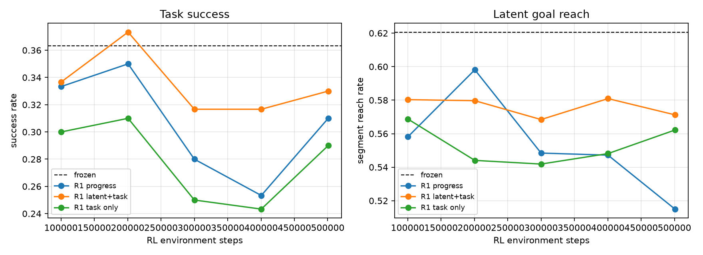

# Low-Level RL Fine-Tuning Results

This report covers the first gated low-level RL study from
[`low_level_rl_tuning_plan.md`](low_level_rl_tuning_plan.md). The executed
method is R1: PPO fine-tuning of a small residual adapter on top of the frozen
deterministic VAE-512 low level at `N_demo=500`, seed 0.

## Setup

- Frozen interface: `vae512_w2048_b1e6`, `k=10`, `U=10`, `H=1`.
- Frozen components: DINO, VAE, normalizers, deterministic high level, and BC
  low level.
- Trainable component: residual Gaussian actor plus critic.
- Main policy input: the same 7,065D low-level condition used by BC.
- Main development bank: 300 episodes starting at seed `3,200,000`.
- Demonstrations: fixed nested `N_demo=500`; no extra demos were used.

Exact local demonstration resets were not available because the stored HDF5
does not contain simulator states or reset seeds. Training therefore used full
hierarchy rollouts while applying the latent-goal reward on each held 10-step
segment.

## Main Result

R1 residual PPO did not improve the frozen hierarchy. The best 500k point is
statistically indistinguishable from frozen on task success and worse on latent
goal reachability.

| method | RL steps | success | final latent MSE | goal reach | final reward |
| --- | ---: | ---: | ---: | ---: | ---: |
| frozen hierarchy | 0 | **0.363** | **1.459** | **0.621** | 0.421 |
| R1 progress | 200,704 | 0.350 | 1.512 | 0.598 | 0.407 |
| R1 latent terminal + weak task | 200,704 | 0.373 | 1.539 | 0.580 | **0.425** |
| R1 task only, full-episode GAE | 500,736 | 0.290 | 1.588 | 0.562 | 0.385 |

## Decision

R1 fails the planned gates:

- Local latent final distance does not decrease by 25%.
- Segment goal-reaching rate does not increase by 15 percentage points.
- Full hierarchy success does not improve by 10 percentage points.
- Larger residual scale (`alpha=0.50`) makes performance substantially worse.
- Pure task reward with full-episode GAE also fails, so the issue is not only
  the 10-step segment termination.

The useful negative result is that naive residual PPO on the visual low-level
condition is not a viable low-level fine-tuning method for this interface. The
likely bottlenecks are reward alignment and online distribution shift, not
high-level latent prediction alone.

## Next Branch

The plan says R2-R4 should only be interpreted after R1 is stable. Since R1 is
not stable, the next implementation should not simply scale residual PPO to
more seeds. Better next tests are:

1. R3 last-layer direct low-level fine-tuning with strict BC regularization.
2. A privileged physical auxiliary reward for TCP/object progress, reported
   separately from the latent-only objective.
3. DAgger or teacher-action recovery data from learner-visited states before
   another RL attempt.

