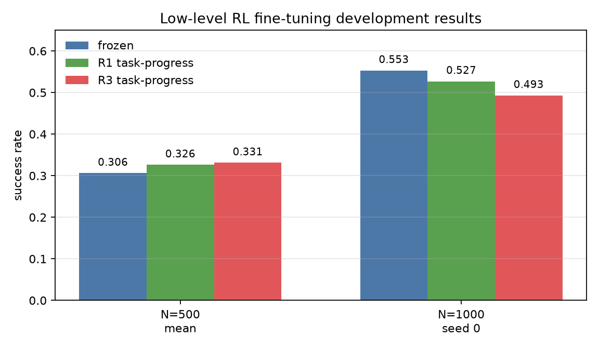

# Low-Level RL Fine-Tuning Results

This report summarizes the low-level RL study from
[`low_level_rl_tuning_plan.md`](low_level_rl_tuning_plan.md). The target system
is the deterministic VAE-512 hierarchy:

```text
interface: vae512_w2048_b1e6 posterior mean
k = 10, U = 10, H = 1
action space: ManiSkill PushT-v1 pd_ee_delta_pos
```

The frozen components are DINOv2-small spatial features, VAE, normalizers,
deterministic high-level predictor, and the BC low-level controller. No extra
demonstration trajectories were added. RL interaction counts are simulator
steps only.

## Constraint

Exact local demonstration resets were not possible because the HDF5 corpus has
`dino`, `proprio`, and `actions`, but no simulator state or reset seed. Training
therefore used full hierarchy rollouts while applying rewards on each held
10-step low-level goal segment.

## Methods Tested

| method | trainable part | reward notes |
| --- | --- | --- |
| R1 residual PPO | small residual actor over frozen deterministic BC low level | latent progress, terminal latent distance, optional task terms |
| R3 direct PPO | final low-policy linear layer + logstd + critic | same reward, BC action regularization |
| R1 task-progress | R1 residual with `alpha=0.05` | latent objective plus dense task-reward progress |
| R3 task-progress | R3 with low direct exploration | latent objective plus dense task-reward progress |

Direct R3 needed a lower exploration scale than R1 because it samples in raw
action space:

```text
low_level_rl.direct_initial_logstd = -4.0
```

## Main Development Results

All numbers below use 300 development episodes starting at seed `3,200,000`.
Checkpoints are selected by training latent distance (`best_train_latent.pt`),
not by evaluation success.

### N=500

| seed | frozen success | R1 task-progress | R3 task-progress |
| ---: | ---: | ---: | ---: |
| 0 | 0.313 | 0.370 | 0.390 |
| 1 | 0.313 | 0.307 | 0.300 |
| 2 | 0.290 | 0.300 | 0.303 |
| mean | 0.306 | 0.326 | 0.331 |

R3 gives the largest mean improvement at N=500, but the gain is mostly seed 0.
R1 is slightly more conservative: smaller improvement, lower action drift.

### N=1000 Confirmation

| policy | success | final latent MSE | goal reach | max reward |
| --- | ---: | ---: | ---: | ---: |
| frozen hierarchy | 0.553 | 1.104 | 0.780 | 0.676 |
| R1 task-progress | 0.527 | 1.133 | 0.767 | 0.656 |
| R3 task-progress | 0.493 | 1.187 | 0.753 | 0.629 |

Both RL variants degrade the stronger N=1000 hierarchy.



## Decision

Low-level PPO fine-tuning is not a robust positive result for this hierarchy.
The best constrained variants give small N=500 gains, but fail the N=1000
confirmation. The final recommendation is to keep the frozen BC low level as
the selected policy for the learned-interface hierarchy, and treat these RL
runs as a limited/negative result.

Useful takeaway: task-progress shaping is more promising than pure latent
distance PPO, but online low-level PPO still appears too noisy without better
local reset/state-query training or teacher-guided recovery data.
