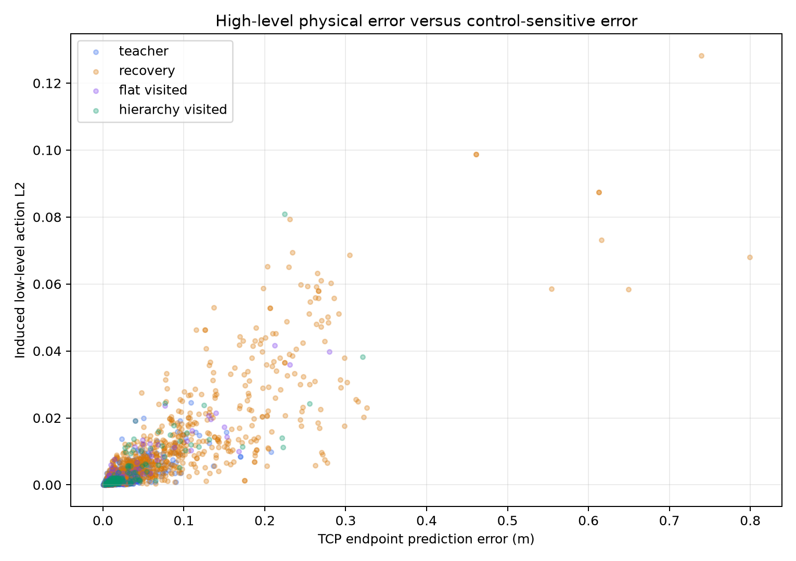
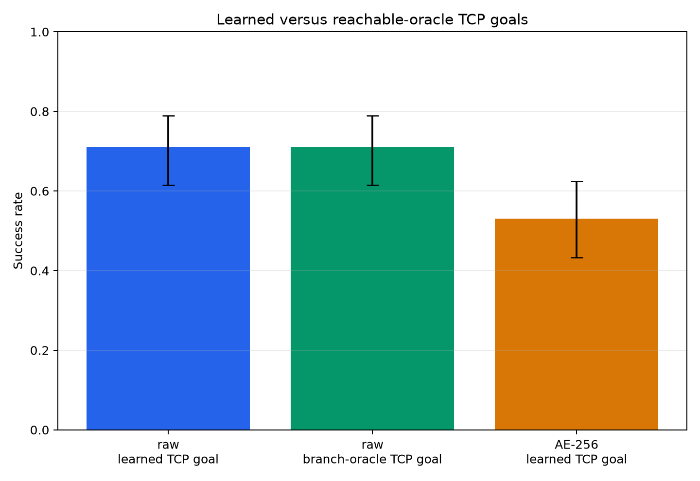

# Push-T Pre-RL Readiness Summary

## Conclusion

The pre-RL study supports a deployable hierarchical Push-T controller, but not
the original future-AE-latent interface.

The selected controller uses:

- frozen DINOv2-small spatial image features plus proprioception as the current
  representation;
- a 3D future TCP endpoint as the high/low interface;
- a 10-step future horizon (`k=10`, 0.50 s);
- a 10-step goal update period (`U=10`, 0.50 s);
- one primitive action per low-level inference (`H=1`, 0.05 s);
- the clean 1,800-trajectory privileged-teacher dataset.

On 100 fixed episodes, the learned hierarchy and the exact reachable branch
oracle both achieve `0.71` success. The learned/oracle success ratio is 1.00,
so the learned high level passes the required 0.8 gate.

The next experiment should use low-level residual RL for recovery while
freezing the image features, high-level TCP predictor, and base low-level
policy. High-level RL is not the first priority because replacing the learned
endpoint with an exact branch endpoint does not improve success.

## Selected Interface

At a high-level decision, the predictor receives:

```text
[normalized spatial-DINO + proprioception, normalized previous action]
```

and predicts the TCP position 10 controls into the future:

```text
p_tcp(t+10)
```

The low level receives:

```text
[
  current spatial-DINO + proprioception,
  desired TCP endpoint,
  (desired endpoint - current TCP) / remaining_time,
  previous executed action,
  normalized remaining time
]
```

It outputs one `pd_ee_delta_pos` action. The endpoint is held for 10 actions,
but velocity and time-to-go are recomputed after every executed action.

This is a future motor waypoint, not an object-effect-only representation.
Phase B showed that future robot/TCP information carries most of the useful
oracle signal. The result should therefore not be described as an
object-effect hierarchy.

## Why `k=10`, `U=10`, `H=1`

The task runs at 20 Hz, so:

- `k=10` is a 0.50 s future goal;
- `U=10` holds that goal for 0.50 s;
- `H=1` replans the primitive action every 0.05 s.

The initial oracle decomposition tested `k in {2,5,10,20}`. Very short goals
were useful but risked reducing the hierarchy to next-action leakage. A
time-conditioned low level was then tested at `k=10` with update periods
`U in {1,2,5,10}` on 100 fixed episodes:

| Update period | Success |
| ---: | ---: |
| 1 | 0.69 |
| 2 | 0.71 |
| 5 | 0.69 |
| 10 | **0.81** |

`k=10`, `U=10` was selected because it gave the best oracle result while
requiring only about 6 high-level decisions per episode. `H=1` was retained
because one-step feedback is important during contact; action chunks were not
needed to establish temporal abstraction because the future endpoint itself
is held across 10 actions.

## Data

### Clean corpus

- Environment: ManiSkill `PushT-v1`
- Backend: CUDA PhysX
- Controller: `pd_ee_delta_pos`
- Frequency: 20 Hz
- Source: deterministic privileged PPO teacher
- Training: 1,800 successful causal trajectories, 80,472 transitions
- Validation: 200 fixed trajectories, 8,969 transitions
- Prepared path:
  `data/prepared/pusht_ppo_dino_spatial_proprio_tcp.h5`

The observation is frozen `facebook/dinov2-small` spatial output pooled to
`4 x 4` and concatenated with 21 non-privileged proprioceptive dimensions.
The resulting current representation is 6,549D.

### Recovery corpus

The recovery corpus contains 1,000 causal episodes with directional bias,
action hold, action delay, and action scaling bursts. Teacher actions are
queried from the states actually reached; states are never restored to a
nominal trajectory.

The exact specification, hashes, and recoverability statistics are in
[`recovery_dataset_spec.md`](recovery_dataset_spec.md).

For the matched hierarchy comparison:

- clean: 60,000 clean current-state queries;
- mixed-25: 45,000 clean and 15,000 coherent recovery queries;
- horizon: 10 uninterrupted future steps;
- identical references for flat and hierarchical policies.

Recovery-rich supervised data did not improve success:

| Method | Training data | Clean | Disturbed | Recovery |
| --- | --- | ---: | ---: | ---: |
| Flat visual BC | clean | 0.48 | 0.44 | 0.31 |
| Flat visual BC | mixed-25 | 0.45 | 0.44 | 0.36 |
| TCP hierarchy | clean | 0.45 | 0.43 | 0.41 |
| TCP hierarchy | mixed-25 | 0.35 | 0.36 | 0.34 |

Clean data is therefore retained for the selected hierarchy. The mixed data
is useful as an RL reset/evaluation distribution, not as the selected
supervised pretraining distribution.

## Architecture and Training

### High-level predictor

```text
input:  6549D current representation + 3D previous action
model:  MLP, width 512, four hidden SiLU layers
output: 3D TCP endpoint
```

Training:

- 60 epochs;
- 200 batches per epoch;
- batch size 512;
- AdamW, learning rate `3e-4`;
- target: TCP position exactly 10 steps in the future;
- checkpoint criterion: lowest predicted-goal low-level action MAE on the
  fixed validation set.

### Low-level policy

```text
input:
  6549D current representation
  6D endpoint and time-to-go velocity goal
  3D previous action
  1D normalized time-to-go
model:
  MLP, width 512, four hidden SiLU layers
output:
  3D pd_ee_delta_pos action
```

Training uses all offsets from 1 through 10. The endpoint is always the
10-step trajectory endpoint, while velocity and time-to-go correspond to the
sampled remaining offset. This makes one low level valid throughout the
10-action hold.

### Deployment

1. Encode current RGB and proprioception.
2. Every 10 actions, predict a new 10-step TCP endpoint.
3. Recompute endpoint velocity and time-to-go every action.
4. Infer one low-level action.
5. Clip to the environment action bounds.
6. Feed the actually executed action back as the previous-action input.

The branch oracle uses the same low level and differs only by replacing the
predicted endpoint with a deterministic teacher endpoint rolled from the
student's exact current simulator state.

## Representation Decision

Raw spatial DINO plus proprioception is selected for the hierarchy.

| Representation | Learned hierarchy success | Endpoint L2 |
| --- | ---: | ---: |
| Raw DINO + proprioception | **0.71** | 0.0173 m |
| AE-256 | 0.53 | 0.0180 m |

AE-256 has better local teacher-action neighborhoods, and VAE-256 has smoother
interpolation, but neither diagnostic outweighs closed-loop control. The raw
representation preserves TCP-transition information best and produces the
strongest hierarchy.

The original future-AE-latent hierarchy remains a useful negative result. In
the three-seed Phase A replication it achieved only `0.327` deterministic and
`0.350` generative success, versus `0.597` visual BC and `0.693` oracle
hierarchy success. Changing the interface, not merely the high-level model,
was necessary.

## Final Performance

### Three-seed reference

Each seed used 200 identical evaluation episodes:

| Method | Mean success | Training-seed std. |
| --- | ---: | ---: |
| Direct visual BC | 0.597 | 0.003 |
| Direct visual flow | 0.582 | 0.025 |
| Matched flat AE latent | 0.485 | 0.023 |
| Original AE-latent oracle hierarchy | 0.693 | 0.070 |
| Original deterministic AE-latent hierarchy | 0.327 | 0.024 |
| Original generative AE-latent hierarchy | 0.350 | 0.035 |

### Selected factorized hierarchy

The selected factorized policies use one training seed and 100 fixed
evaluation episodes:

| Method | Success | 95% Wilson interval | Final reward |
| --- | ---: | --- | ---: |
| Raw learned TCP endpoint | **0.71** | [0.615, 0.790] | 0.781 |
| Raw exact branch TCP endpoint | **0.71** | [0.615, 0.790] | 0.794 |
| AE-256 learned TCP endpoint | 0.53 | [0.433, 0.625] | 0.639 |

The learned/oracle success ratio is `1.00`. Replay current-state error for the
oracle branch is exactly zero.

Ten learned-policy videos on seeds 1,930,000-1,930,009 contain seven successes
and three failures. Exact-oracle counterparts were recorded for the three
learned failures. The oracle also fails on seeds 1,930,006 and 1,930,007, but
rescues seed 1,930,009. Thus endpoint prediction is decisive on some episodes,
while other failures belong to the shared low-level/controller path. Videos
are stored locally under:

```text
results/incremental/pre_rl/phase_f/raw_tcp/seed0/videos/
```

## Predictor Diagnostics

| State distribution | TCP endpoint error | Induced low action L2 |
| --- | ---: | ---: |
| Held-out teacher | 0.0175 m | 0.0016 |
| Coherent recovery | 0.0611 m | 0.0080 |
| Flat-policy visited | 0.0348 m | 0.0045 |
| Hierarchy visited | 0.0372 m | 0.0047 |

Endpoint error and induced action error are strongly correlated, but the
errors on hierarchy states remain small enough that replacing learned goals
with exact goals does not change success. Recovery states are the clearest
remaining distribution shift.





## Gate Decisions

1. **Reproducible performance gap:** passed. The original learned-latent
   hierarchy remains below flat policies across three seeds.
2. **Oracle semantics:** passed. Future TCP/robot motion carries the useful
   signal; object-only goals are not sufficient at the selected setting.
3. **Temporal abstraction:** passed. The selected endpoint is 0.50 s ahead and
   held for 10 primitive controls.
4. **Recovery-rich comparison:** completed. Recovery-rich supervised training
   does not improve success.
5. **Goal representation:** passed for the compact TCP waypoint interface.
6. **Learned high level:** passed. Learned success is 100% of matched oracle
   success.
7. **RL objective:** chosen below.

Phase H multimodality experiments are not indicated: deterministic regression
already matches the reachable oracle. Phase I wrist-camera experiments are
also not indicated: the base camera supports the passing learned hierarchy,
and predictor error is not the current success bottleneck.

## RL Recommendation

Start with **low-level residual recovery RL**, not joint end-to-end RL.

Freeze:

- DINO image features;
- current raw representation preprocessing;
- deterministic 10-step TCP endpoint predictor;
- base time-conditioned low-level policy.

Train a small residual action adapter:

```text
a = clip(a_BC + delta_a_RL)
```

Use:

- resets from both clean teacher states and the stored causal recovery states;
- the learned TCP endpoint as the fixed goal source;
- one-step actions with endpoint replanning every 10 actions;
- task progress/success plus local endpoint-reaching reward;
- a residual magnitude or KL penalty to preserve nominal behavior.

The primary RL KPI should be disturbed/recovery success while constraining
clean success to remain within five percentage points of the frozen
hierarchy. Compare against the frozen learned hierarchy, exact branch oracle,
and flat visual baseline.

Do not jointly fine-tune the high and low levels in the first RL experiment.
There is no measured high-level oracle gap to justify that additional
instability.

## Reproduction

```bash
CONFIG=configs/pusht_incremental.yaml

uv run hcl-poc incremental pre-rl-f-train-visual-tcp \
  --config "$CONFIG" --representation raw

uv run hcl-poc incremental pre-rl-f-eval-visual-tcp \
  --config "$CONFIG" --representation raw --goal-source learned --episodes 100

uv run hcl-poc incremental pre-rl-f-eval-visual-tcp \
  --config "$CONFIG" --representation raw --goal-source oracle \
  --episodes 100

uv run hcl-poc incremental pre-rl-g-tcp-diagnostics \
  --config "$CONFIG"

uv run hcl-poc incremental pre-rl-f-record-visual-tcp \
  --config "$CONFIG" --representation raw --goal-source learned --episodes 10
```

The chronological record is in
[`next_experiments_log.md`](next_experiments_log.md). Candidate details for
the earlier Phase 12 latent study remain in
[`FINAL_RESULTS_AND_CANDIDATES.md`](FINAL_RESULTS_AND_CANDIDATES.md).
