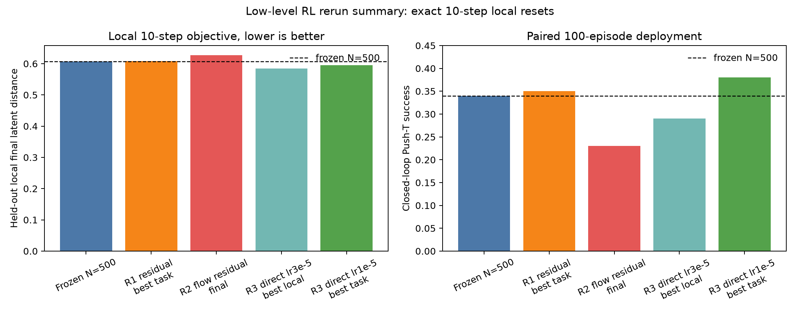

# RL Rerun Final Results

This report summarizes the low-level RL rerun from
`low_level_rl_rerun_state_parallel_plan.md`. The chronological execution log is
`rl_rerun_experiment_log.md`. The requirement-by-requirement completion audit
is `rl_rerun_completion_audit.md`; this file is the compact results view.

## Main Result

The best development-bank low-level RL variant was direct deterministic
low-level last-layer tuning:

```text
R3 direct last-layer, N=500, lr=1e-5, bc_weight=1.0
```

It improved paired 100-episode closed-loop Push-T success on the two serious
policy seeds tested during development:

| Policy seed | Selected checkpoint | Frozen success | Tuned success | Delta |
| ---: | ---: | ---: | ---: | ---: |
| 0 | 409600 | 0.34 | 0.38 | +0.04 |
| 1 | 614400 | 0.39 | 0.40 | +0.01 |

The selected checkpoints were then evaluated on a larger fresh 500-episode bank.
The fresh-bank result is mixed and averages to essentially zero improvement:

| Policy seed | Eval bank | Episodes | Frozen success | Tuned success | Delta |
| ---: | --- | ---: | ---: | ---: | ---: |
| 0 | fresh seeds `20000-20499` | 500 | 0.306 | 0.282 | -0.024 |
| 1 | fresh seeds `20000-20499` | 500 | 0.296 | 0.316 | +0.020 |
| mean | fresh seeds `20000-20499` | 500 each | 0.301 | 0.299 | -0.002 |

The final takeaway is therefore that R3 does not robustly improve closed-loop
deployment: it improved local latent reaching and looked positive on the small
development bank, but the two-seed fresh-bank mean is flat.

## Required Run Facts

| Item | Value |
| --- | --- |
| Simulator backend | ManiSkill CUDA PhysX (`physx_cuda`) |
| Main RL environment count | `4096` parallel vector envs |
| Local rollout length | `10` steps |
| Effective PPO batch | `4096 x 10 = 40960` samples/update |
| Serious RL budget | `1,024,000` transitions per main run |
| Action space | `pd_ee_delta_pos`, 3D continuous |
| Local goal horizon | `10` simulator steps |
| Task reward used in training | No |
| Task success used in training | No |
| Object pose/task progress used in training | No |
| Training reward | latent progress minus terminal latent distance |
| Exact local resets | Passed on vector-consistent corpora |
| Termination/GAE handling | One complete local episode per rollout; GAE terminates at the 10-step segment boundary |
| GPU memory | Not captured as a numeric time-series; `4096` envs was stable, `8192` failed camera-group allocation |
| Wall-clock | Recovered from raw tqdm logs for R2/R3 serious runs; R1 raw logs are missing |

## Data And Artifacts

| Artifact | Purpose |
| --- | --- |
| `data/rl_rerun/pusht_state_demos.h5` | 1200 single-env state-loadable teacher trajectories |
| `data/rl_rerun/pusht_vector_state_demos_n4096_b2.h5` | main 4096-env exact-reset RL corpus |
| `data/rl_rerun/pusht_vector_state_demos_n4096_val_b1.h5` | independent 4096-env validation corpus |
| `data/rl_rerun/pusht_vector_state_demos_n512_val_b1.h5` | cheap fixed checkpoint-selection corpus |
| `rl_rerun_vector_state_audit_n4096_b2.json` | exact replay audit for the main corpus |
| `rl_rerun_throughput_rollout10_large.csv` | 10-step throughput benchmark |
| `rl_rerun_recovered_wallclock.csv` | recovered wall-clock telemetry from available raw PPO logs |
| `rl_rerun_completion_audit.md` | requirement-by-requirement completion status |
| `rl_rerun_local_r3_n500_seed0_409k_closed_loop_500_seed20000.json` | tracked fresh 500-episode R3 seed0 evaluation |
| `rl_rerun_local_r3_n500_seed1_614k_closed_loop_500_seed20000.json` | tracked fresh 500-episode R3 seed1 evaluation |
| `rl_rerun_local_r3_n500_seed0_409k_disturbed_100_seed30000.json` | tracked disturbed/recovery R3 seed0 diagnostic |
| `rl_rerun_local_r3_n500_seed1_614k_disturbed_100_seed30000.json` | tracked disturbed/recovery R3 seed1 diagnostic |
| `rl_rerun_local_r3_n500_seed0_409k_disturbed_500_seed40000.json` | tracked fresh 500-episode disturbed R3 seed0 evaluation |
| `rl_rerun_local_r3_n500_seed1_614k_disturbed_500_seed40000.json` | tracked fresh 500-episode disturbed R3 seed1 evaluation |
| `rl_rerun_local_r3_n500_seed0_409k_oracle_replay_100_seed50000.json` | tracked 100-episode replay-oracle R3 seed0 diagnostic |
| `rl_rerun_local_r3_n500_seed1_614k_oracle_replay_100_seed50000.json` | tracked 100-episode replay-oracle R3 seed1 diagnostic |
| `rl_rerun_local_r3_n500_seed0_409k_learned_goal_100_seed50000.json` | matched learned-goal R3 seed0 comparison on oracle seed bank |
| `rl_rerun_local_r3_n500_seed1_614k_learned_goal_100_seed50000.json` | matched learned-goal R3 seed1 comparison on oracle seed bank |
| `rl_rerun_goal_sensitivity_summary_seed50000.json` | compact learned-vs-oracle goal-sensitivity summary |
| `rl_rerun_valid_goal_sensitivity_seed0_2048.json` | same-state `k=9/10/11` valid-goal sensitivity diagnostic |
| `rl_rerun_valid_goal_sensitivity_seed0_2048_wide.json` | same-state `k=2/5/10/20` valid-goal sensitivity diagnostic |
| `rl_rerun_condition_block_sensitivity_seed0_2048.json` | observation/goal/previous-action block sensitivity diagnostic |
| `rl_rerun_action_block_prediction_seed0_8192_2048.json` | one-step teacher-action predictability by condition block |
| `rl_rerun_goal_conditioning_identifiability.md` | synthesis note explaining why one-step deterministic labels weakly identify goal use |
| `rl_rerun_goal_identifiable_next_plan.md` | concrete next-experiment plan with diagnostics and promotion gates |
| `rl_rerun_phase_g1_goal_delta_residual_smokes.json` | first Phase G1 goal-dominant residual smoke comparison |
| `rl_rerun_phase_g1_margin_scaled_smoke.json` | Phase G1 margin-scaled residual smoke summary |
| `scripts/rl_rerun_goal_mismatch_audit.py` | reproducible learned-vs-oracle goal mismatch audit |
| `scripts/rl_rerun_valid_goal_sensitivity.py` | reproducible same-state valid-goal sensitivity diagnostic |
| `scripts/rl_rerun_condition_block_sensitivity.py` | reproducible condition-block sensitivity diagnostic |
| `scripts/rl_rerun_action_block_prediction.py` | reproducible action-block prediction diagnostic |
| `rl_rerun_failure_videos/` | paired frozen/tuned deployment videos for the best R3 checkpoint |

The single-env corpus replays exactly in a single-env CUDA simulator, but
single-env intermediate states are not vector-reset equivalent. Serious local
RL therefore uses vector-consistent corpora collected with the same vector width
used for reset/replay.

The main `4096`-env RL corpus is already disjoint from the supervised low-level
BC demonstrations by reset seed: the BC demos use `920001-921498`, while the
main RL corpus uses vector batches seeded at `9800000` and `9800001`. The
`512`-env disjoint-state R1 row below is an extra independent-state ablation,
not the only disjoint-state RL test; its PPO batch is much smaller
(`512 x 10 = 5120`) than the serious runs (`4096 x 10 = 40960`).

## Supervised Baselines

The rerun retrained the VAE/high/low hierarchy from the regenerated data.

| N trajectories | Seeds | Closed-loop success mean | Sample SD |
| ---: | ---: | ---: | ---: |
| 500 | 3 | 0.280 | 0.036 |
| 1000 | 3 | 0.457 | 0.025 |

These are supervised frozen-hierarchy baselines, not RL-tuned results.

## RL Results

All main RL rows below use exact 10-step local resets. Most closed-loop
deployment rows use paired 100-episode development banks; the fresh-bank R3 rows
use 500 episodes and are the stronger deployment checks.

| Method | N | Main envs | Steps | Best local final distance | Closed-loop success | Delta vs frozen |
| --- | ---: | ---: | ---: | ---: | ---: | ---: |
| Frozen deterministic low level | 500 | n/a | 0 | 0.6073 | 0.34 | 0.00 |
| R1 residual deterministic, best task checkpoint | 500 | 4096 | 1.024M | 0.6083 | 0.35 | +0.01 |
| R1 disjoint-state ablation | 500 | 512 | 1.024M | 0.5958 | 0.30 | -0.04 |
| R2 residual flow low level | 500 | 4096 | 1.024M | 0.6267 | 0.23 | -0.05 vs flow base |
| R3 direct last-layer, lr=3e-5 | 500 | 4096 | 1.024M | 0.5851 | 0.29 at local-best | -0.05 |
| R3 direct last-layer, lr=1e-5, seed0 dev bank | 500 | 4096 | 1.024M | 0.5932 | 0.38 | +0.04 |
| R3 direct last-layer, lr=1e-5, seed0 fresh 500 bank | 500 | 4096 | 1.024M | 0.5932 | 0.282 | -0.024 |
| R3 direct last-layer, lr=1e-5, seed1 dev bank | 500 | 4096 | 1.024M | 0.6171 | 0.40 | +0.01 |
| R3 direct last-layer, lr=1e-5, seed1 fresh 500 bank | 500 | 4096 | 1.024M | 0.6171 | 0.316 | +0.020 |
| R3 direct last-layer, lr=1e-5, fresh 500 mean | 500 | 4096 | 1.024M | n/a | 0.299 | -0.002 |

The development summary plot is:



## Candidate Details

### R1: Residual Deterministic Low Level

Base action:

```text
a = frozen_low(condition) + alpha * tanh(residual)
```

Best closed-loop R1 checkpoint improved success only from `0.34` to `0.35`.
The locally best checkpoint did not transfer to deployment.

### R2: Residual Flow Low Level

The frozen base was a zero-noise endpoint from a low-level action-flow model
trained on the same low-level condition as the deterministic policy.

The flow base itself was weaker than the deterministic low level. R2 improved
local latent reaching relative to the flow base but worsened full deployment:

```text
frozen flow base success: 0.28
R2 tuned success:        0.23
```

R2 did not establish a stable flow base, so R4 direct-flow tuning was not run.

### R3: Direct Deterministic Low-Level Tuning

The tuned actor is the deterministic low-level policy itself. Only the final
low-policy layer, actor log-std, and critic were trainable. A BC regularizer
penalized deviation from the frozen low-level action.

`lr=3e-5` gave the best local final distance but overfit the local objective and
hurt deployment. Reducing the direct learning rate to `1e-5` preserved a smaller
local gain and improved closed-loop success on two 100-episode development
banks:

| Seed | Checkpoint | Frozen success | Tuned success | Final reward delta | Max reward delta |
| ---: | ---: | ---: | ---: | ---: | ---: |
| 0 | 409600 | 0.34 | 0.38 | +0.0307 | +0.0315 |
| 1 | 614400 | 0.39 | 0.40 | +0.0224 | +0.0156 |

The selected seed0 and seed1 checkpoints were then evaluated on 500 fresh seeds:

| Seed | Checkpoint | Eval seeds | Episodes | Frozen success | Tuned success | Final reward delta | Max reward delta |
| ---: | ---: | --- | ---: | ---: | ---: | ---: | ---: |
| 0 | 409600 | `20000-20499` | 500 | 0.306 | 0.282 | -0.0097 | -0.0154 |
| 1 | 614400 | `20000-20499` | 500 | 0.296 | 0.316 | +0.0171 | +0.0148 |

These larger fresh-bank results override the small development-bank optimism for
the final deployment interpretation. Seed1 remains positive, but the two-seed
fresh-bank mean is `0.299` tuned versus `0.301` frozen.

The same two checkpoints were also evaluated with action-bias, action-hold,
action-delay, and action-scaling perturbations. The 100-episode diagnostic was
positive, but the 500-episode disturbed bank was not:

| Bank | Seed | Checkpoint | Frozen success | Tuned success | Success delta | Frozen recovery | Tuned recovery | Recovery delta |
| --- | ---: | ---: | ---: | ---: | ---: | ---: | ---: | ---: |
| diagnostic 100 | 0 | 409600 | 0.32 | 0.33 | +0.01 | 0.29 | 0.31 | +0.02 |
| diagnostic 100 | 1 | 614400 | 0.30 | 0.35 | +0.05 | 0.29 | 0.32 | +0.03 |
| diagnostic 100 mean | n/a | n/a | 0.31 | 0.34 | +0.03 | 0.29 | 0.315 | +0.025 |
| fresh 500 | 0 | 409600 | 0.292 | 0.260 | -0.032 | 0.284 | 0.254 | -0.030 |
| fresh 500 | 1 | 614400 | 0.254 | 0.258 | +0.004 | 0.250 | 0.250 | 0.000 |
| fresh 500 mean | n/a | n/a | 0.273 | 0.259 | -0.014 | 0.267 | 0.252 | -0.015 |

The 500-episode disturbed result matches the clean result: no robust deployment
or recovery improvement.

Seed2 failed the cheap 10k local final-distance screen (`0.6913` tuned versus
`0.6836` frozen), so it has not been promoted to a serious `4096`-env run.

### N=1000 R3 Screen

The promising R3 variants were smoke-tested at `N=1000` before launching a full
4096-env run. Both were locally worse than the frozen `N=1000` low level:

| Policy | Final distance | Reduction fraction |
| --- | ---: | ---: |
| N=1000 frozen | 1.1175 | 0.8359 |
| N=1000 R3 lr=1e-5, 10k | 1.1249 | 0.8184 |
| N=1000 R3 lr=3e-5, 10k | 1.1193 | 0.8223 |

The full `N=1000` R3 run was skipped because the cheap exact-reset screen
failed.

### Branch-Oracle Diagnostic

The R1/R2/R3 closed-loop evaluator now supports `--goal-source oracle`. In this
mode the high-level latent goal is generated online by rolling the deterministic
privileged teacher for `10` steps from the student's current state. The trusted
mode is `--oracle-copy-mode replay`, which recreates the branch state by
resetting to the same seed and replaying the executed student action history.

A faster `state_dict` copy mode was tested, but a 4-episode comparison changed
the policy-result outcome despite only `1.19e-7` flat simulator-state error.
A follow-up parity audit showed current-state, observation, and teacher-action
errors near `1e-6`, but after the 10-step branch rollout the encoded future
goal differed substantially from replay mode. Even when both branches used the
same teacher actions, future encoded-goal L2 error averaged `5.19`. Use replay
mode for primary oracle evidence unless a stronger simulator/internal-state
copy method is implemented.

Bounded 100-episode replay-oracle diagnostic:

| Policy seed | Checkpoint | Frozen success | Tuned success | Delta | Max replay error |
| ---: | ---: | ---: | ---: | ---: | ---: |
| 0 | 409600 | 0.36 | 0.37 | +0.01 | 0.0 |
| 1 | 614400 | 0.37 | 0.39 | +0.02 | 0.0 |
| mean | n/a | 0.365 | 0.380 | +0.015 | 0.0 |

This is not a final 500-episode oracle gate. It is useful evidence that the
replay branch-oracle path is wired and exact at the current-state level, but
the positive performance signal is small and too low-budget to change the final
RL rerun conclusion.

On the same `50000-50099` evaluation seeds, learned-goal deployment was worse
than replay-oracle deployment:

| Goal source | Frozen success | Tuned success | Tuned-vs-frozen delta |
| --- | ---: | ---: | ---: |
| learned high-level | 0.390 | 0.330 | -0.060 |
| replay oracle | 0.365 | 0.380 | +0.015 |

This matched-bank comparison suggests that the learned high-level goal quality
or its compounding errors are part of the remaining deployment bottleneck.

A direct goal-mismatch audit on 20 learned-goal episodes per selected R3 seed
supports that diagnosis but adds an important caveat:

| Metric | Mean across seeds |
| --- | ---: |
| Learned-vs-oracle future latent L2 | 25.02 |
| Oracle goal displacement from current latent | 27.16 |
| Learned goal displacement from current latent | 27.57 |
| Tuned low-level action L2 from swapping learned goal to oracle goal | 0.033 |

The learned and oracle goals are far apart in latent space, but the low-level
action changes only weakly. The remaining bottleneck is therefore not just
high-level prediction error; the low-level interface may also be too insensitive
to the future-goal input.

Aggregating all per-replan rows, the tuned action response is only `0.00117`
action-L2 per unit of latent goal-L2, and R3 tuning does not increase this
sensitivity relative to the frozen low level (`0.00118`). Goal mismatch and
action change are correlated (`r=0.400`), but the action gain is very small.

A stricter same-state diagnostic using same-trajectory future goals at
`k=9/10/11` confirms the weak interface. The nearby valid future latents differ
by mean L2 `~16`, but frozen and tuned low-level actions change only `~0.0085`
L2. The RR-48 goal-sensitivity hinge smoke is indistinguishable from frozen on
this metric.

The same conclusion holds for wider same-state horizons `k=2/5/10/20`: goal
latent differences are `~24-27` L2, but action changes are only `~0.016-0.022`
L2. The tuned R3 checkpoint is slightly less sensitive than frozen, and the
sensitivity-hinge smoke remains effectively identical to frozen.

Condition-block ablation explains this: shuffling the current observation block
changes actions by about `0.805` L2, while shuffling the future-goal block
changes actions by only `~0.048-0.050` L2. Previous action has a similar or
slightly larger effect than the goal block.

A scratch action-prediction ablation reaches raw action L2 `0.227` from
observation only versus `0.404` from goal only. Adding the goal to observation
improves raw L2 by only `0.020`, so the one-step teacher label itself provides
weak pressure to rely on future latents.

The synthesis note `rl_rerun_goal_conditioning_identifiability.md` makes this
explicit: for a fixed current state, one-step deterministic teacher imitation
has the same action label for same-trajectory goals at different horizons. The
future goal is therefore not behaviorally identifiable unless training uses
multi-step goal-reaching rollouts, counterfactual branch data, or a stronger
goal-gated low-level formulation.

The follow-up plan `rl_rerun_goal_identifiable_next_plan.md` makes this the next
execution path. It requires cheap valid-goal and condition-block sensitivity
gates to improve before another full 1.024M-transition RL run or final
closed-loop evaluation.

The first Phase G1 smokes added a `goal_delta` residual condition mode. Both
initial settings plus a lower-exploration variant were not promoted: one-batch
local final distances were acceptable (`0.6196`, `0.6232`, `0.6249`), but
training action saturation stayed around `18%`, above the `5%` gate.

The follow-up `margin_scaled` residual action mode fixed that saturation issue:
train/eval saturation was `0.0`, with one-batch final distance `0.6266`.
However, valid-goal sensitivity remained weak. The wide `k=2` versus `k=10`
action L2 was only `0.0255`, below the `0.08` promotion gate, so this setting
also should not be promoted to a serious 1.024M-transition run.

## Gate Decisions

| Gate | Decision | Evidence |
| --- | --- | --- |
| State-loadable data | Pass | exact reset/replay audits pass on vector-consistent corpora |
| Supervised retraining | Pass | N=500 and N=1000 frozen hierarchies retrained and evaluated |
| Throughput | Pass | `4096 x 10` stable, batch `40960`; `8192` fails allocation |
| RL correctness | Pass for local PPO setup | no task reward/progress in training; 10-step segment boundary |
| R1 local gate | Fail | local gains far below 25% target |
| R2 flow gate | Fail | flow base weak; residual degrades deployment |
| R3 direct tuning | No robust fresh deployment gain | fresh 500-bank deltas are `-0.024` and `+0.020`, mean `-0.002`; earlier `+0.04`/`+0.01` were development-bank results |
| Disturbed/recovery gate | Fail | 500-episode disturbed mean success delta `-0.014`, recovery delta `-0.015`; 100-episode diagnostic was optimistic |
| Branch-oracle diagnostic | Bounded only | 100-episode replay-oracle seed results are `+0.01` and `+0.02`; exact replay error `0.0`; no final-budget gate claim |
| Matched learned-vs-oracle goal check | Diagnostic only | same 100 eval seeds: tuned learned-goal success `0.330`, tuned replay-oracle success `0.380` |
| Learned-vs-oracle goal mismatch | Diagnostic only | learned and oracle future latents differ by mean L2 `25.02`, but tuned action changes only `0.033` L2 |
| Goal sensitivity | Diagnostic only | tuned action changes by only `0.00117` L2 per unit latent-goal L2; R3 does not improve this over frozen |
| Same-state valid-goal sensitivity | Diagnostic only | same-trajectory `k=9/10/11` future latents differ by mean L2 `~16`, but actions change only `~0.0085` L2 |
| Wide-horizon valid-goal sensitivity | Diagnostic only | same-trajectory `k=2/5/10/20` future latents differ by mean L2 `~24-27`, but actions change only `~0.016-0.022` L2 |
| Condition-block sensitivity | Diagnostic only | observation-block shuffle changes actions by `~0.805` L2, goal-block shuffle by only `~0.048-0.050` L2 |
| Action block prediction | Diagnostic only | obs-only raw action L2 `0.227`, goal-only `0.404`, obs+goal improves obs-only by only `0.020` |
| Goal-conditioning identifiability | Diagnostic conclusion | one-step deterministic action labels are invariant to same-current-state horizon changes, so goal use is weakly identified |
| Phase G1 goal-dominant residual smokes | Fail | `goal_delta` residual smokes had train action saturation `0.184`, `0.176`, and `0.176`, above the `0.05` gate |
| Phase G1 margin-scaled residual smoke | Fail | saturation fixed at `0.0`, but `k=2` vs `k=10` action L2 was only `0.0255`, below `0.08` |
| N=1000 confirmation | Not passed | smoke variants locally worse than frozen N=1000 |
| Final multi-seed RL gate | Fail/incomplete | two fresh 500-episode banks average to `-0.002`; third seed failed cheap screen |

## Interpretation

The rerun invalidates the earlier weak RL attempt as a definitive negative:
using exact local resets and large vector batches matters. However, residual
low-level PPO did not solve the problem. Directly tuning the deterministic
low-level final layer improves local latent reaching more reliably than the
residual variants, but the closed-loop gain did not hold on fresh larger
evaluation banks.

The disturbed/recovery result follows the same pattern as clean deployment:
small-bank diagnostics can look positive, but the larger 500-episode bank does
not support a benefit.

The current best scientific conclusion is:

> Low-level RL improved some local latent-reaching metrics and small
> development-bank evaluations, but the current best R3 setting averages to no
> improvement over two fresh 500-episode clean evaluations and is slightly worse
> on two fresh 500-episode disturbed evaluations. The current evidence does not
> support using this low-level RL rerun as an improvement over the frozen
> hierarchy. The replay-oracle diagnostics further suggest that learned
> high-level goal quality matters, but the current low level is also weakly
> sensitive to large future-goal changes, so the next learned-interface attempt
> should address both prediction quality and goal-conditioned control.

## Remaining Instrumentation Gaps

- Raw tqdm logs recover wall-clock for the available serious R2/R3 runs:
  `59:29` for R2 seed0, `59:51` for R3 lr=3e-5 seed0, `59:25` for R3 lr=1e-5
  seed0, and `59:02` for R3 lr=1e-5 seed1. The R1 raw PPO logs are not present,
  and the old R1 histories have no timing fields.
- New R1/R2/R3 runs now store wall-clock and peak CUDA-memory telemetry, but the
  already completed serious RL runs do not contain retrospective GPU-memory
  time-series.
- A future positive claim would need a new method or tuning rule that first
  improves a fresh held-out deployment bank.

## Videos

Representative paired videos for the best R3 checkpoint are in
`rl_rerun_failure_videos/`.

```text
checkpoint: artifacts/rl_rerun/local_r3/n500/seed0/aligned10_n4096_lr1e5_bc1_1m/checkpoints/step_000409600.pt
evaluation seeds: 10000-10005
modes: frozen, tuned
```

The filenames include `success`, `final`, and `max` reward fields. The set
contains both successes and failures for qualitative inspection.
